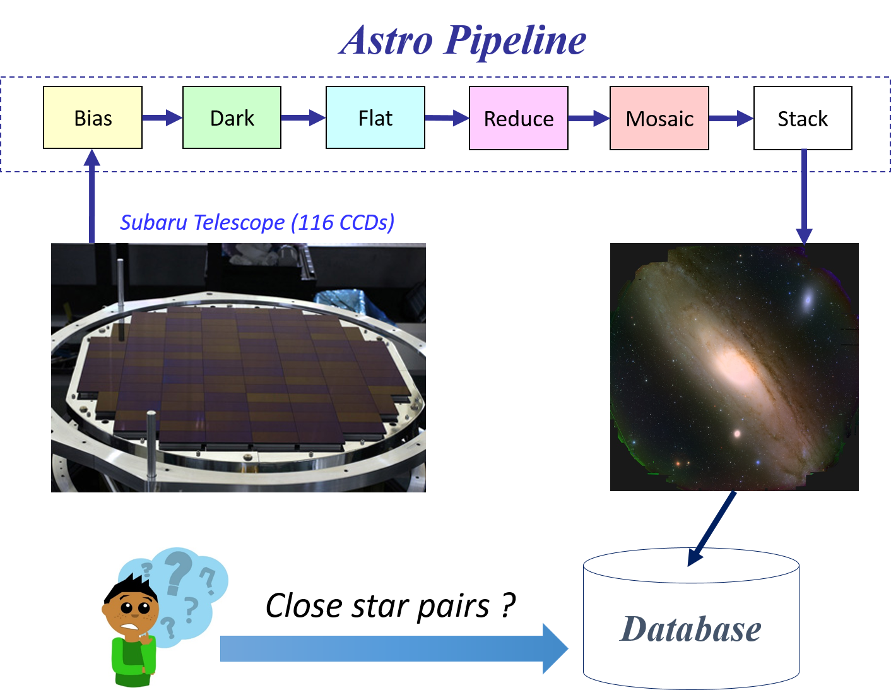

システムソフトウェアチーム
==================
<!-- this is a comment. -->

------------

2017年9月伊香保温泉における実装合宿

<!--
/img>-->

研究トピック
------------

#### [エクストリームビッグデータ](http://www.extreme-bigdata.jp/?page_id=79)の基盤技術

[エクストリームビッグデータ](http://www.extreme-bigdata.jp/?page_id=79)とは、現状の数千〜数百万倍ともいわれる大規模ビッグデータであり、様々な分野で今後その大きさのビッグデータ解析が必要といわれています。その大きさのデータを処理するためには、HPC、クラウド、グリッド技術をベースに基盤技術の研究開発が必要となります。そこで、分散ストレージシステム、並列分散実行時システムなどの研究開発を行っています。

#### 分散ファイルシステム

ビッグデータ処理を行うためのソフトウェア基盤として<a href=http://oss-tsukuba.org/software/gfarm>Gfarmファイルシステム</a>の開発を行っています。本ソフトウェアは研究開発基盤としてだけではなく、<a href=http://www.hpci-office.jp/pages/hpci_2016_st-1>HPCI共用ストレージ</a>や[Active! world](http://www.qualitia.co.jp/service/aw)など大規模な実運用もされています。Gfarmファイルシステムをベースに新しい機能の拡張や性能評価など研究も進められますし、新しいファイルシステムの研究開発もできます。

<!--
#### [天文ビッグデータ（川島）](https://www.jst.go.jp/kisoken/crest/project/44/14532369.html)

[Kavli IPMU](http://www.ipmu.jp/ja)、[国立天文台](http://www.nao.ac.jp/)との共同研究により、宇宙の詳細な仕組みについて解明する研究を行っています。 右の図では、すばる望遠鏡から得られたデータが天文パイプラインにより処理され、その結果として美しい画像が得られる様子が示されています。毎晩の撮像データサイズは数百GBです。  
世界的な競争に勝つために、この天文パイプラインを高速化する必要があります。そのためには、ログ先行書込み、分散トランザクション、そして並行実行制御などの技術を深化させる必要があり、それらに取り組んでいます。 さらに、画像から得られる銀河の数は100億以上です。これらのデータはいわゆるDBMSにおいて管理されるため、その高速処理が必要になります。そこでMapReduce処理系、空間索引、分散合意技術などのデータシステム技術を深化させています。
</img>
-->

#### OpenNVMを用いたオブジェクトストレージシステム
分散ファイルシステムを高性能化するには、メタデータ操作を高性能化する必要があります。このために我々はオブジェクトストレージシステムを新たに研究開発しました。このシステムはOpenNVMと呼ばれる不揮発メモリ向けの新しいAPIを駆使することで、従来のシステムであるXFSやdirectFSに比べて10倍以上の高性能化を達成しています。具体的には48bitの仮想アドレス空間、書込み単位でのアトミックな更新を利用しています。[[詳細はこちら]](https://www.jstage.jst.go.jp/article/ipsjjip/24/5/24_824/_pdf)
</img>

<!--ここに研究トピックについて記述します．-->

<!-- 所属教員・研究員 -->

メンバー
--------

<!-- |教員名|職階|研究分野に関するキーワード| -->

|名前|職階|研究内容・メッセージ| 
|:-----|:---|:-------------------------|
|[建部 修見](http://www.hpcs.cs.tsukuba.ac.jp/~tatebe/)|教授|分散ファイルシステム, 並列システムソフトウェア システムソフトウェアに興味がある人、大きいことをやってみたい人は是非どうぞ。好きなことをやってください。|
|Mohamed Amin JABRI|研究員|Highly concurrent indexing data-structures (B+Tree), concurrency from a parallel programing perspective I am interested in designing lock-free concurrent self-balancing data-structures, like B+tree, that could be used to enable range-queries and searches over hash-based Key-Value Stores (KVS) running natively on flash devices. Additionally, I have a keen interest in scalable memory management and recycling techniques and strategies in the case of lock-free data-structures.|
|田中 昌宏|研究員|並列分散ワークフローシステムPwrake Rakeをベースにして設計され、分散ファイルシステムGfarmと高い親和性をもつワークフローシステムPwrakeを研究開発しています。[RubyKaigiでの講演はこちら](http://rubykaigi.org/2016/presentations/masa16tanaka.html)|
|平賀 弘平|D3|-|
|瀧沢 亮太|M2|暗号化データ処理の並列・分散化による高性能化 最先端の研究，親身に相談にのってくださる先生方，高い知識や能力を持った学生，ハイスペックマシン，良質な環境，HPCS研究室は全て揃っています．|
|大黒 晴之|M2|通信手段とアルゴリズムによるMapReduce上のShuffle操作の高性能化 [[論文]](http://dl.acm.org/citation.cfm?id=2926538) このチームはビッグデータ時代を支える縁の下の力持ち的な存在です。雰囲気は和やかですが、非常にハイレベルな知識、技術を身につけることができます。|
|村田 直郁|M2|分散データベースにおけるトランザクション処理の高性能化 ビッグデータチームが扱う研究テーマは分散システムやDBMSカーネルといったビッグデータ処理の基盤となる分野です。研究では結構コードを書くので、プログラミングが好きな人にはぴったりだと思います。プログラミングに自信はないけど、これからたくさんコードを書いて腕を上げたいと思っている人にも最適です！私は[PostgreSQL hack](https://github.com/nao23/pax-on-postgresql)とか[Mesos(Retz)](https://github.com/nao23/retz)とか[分散トランザクション](https://github.com/nao23/ramp-with-rdma)とかやってます。|
|岩井 厚樹|M1|分散ファイルシステム BigDataチームは100台を超える計算機を所有しています。それらを使ってプログラムを実行することはもちろん、計算機の保守・管理も経験することができます。私たちと一緒にこの恵まれた環境で研究してみませんか？|
|小林 淳司|M1|分散ファイルシステム HPCS研究室には研究を行うための環境がそろっていて、新しい技術に触れられる機会も多いです。ビッグデータやその基盤となる技術を研究してみたいという方にはとてもいい研究室だと思います。|
|中村 泰大|M1|並行実行制御手法<a href="http://people.csail.mit.edu/sanchez/papers/2016.tictoc.sigmod.pdf">TicToc</a>の改善 先生・先輩からのサポートも手厚く、個々人の興味に合わせて研究内容を、一緒になって真剣に考えていけます。いわゆるビッグデータの花形となる分野ではなく、その基盤となる分野を取り扱っています。エンジニアやビッグデータを支えるものづくり/研究に興味がある方にぴったりかと思います。|
|渡辺 敬之|M1|並行実行索引木<a href="https://pdos.csail.mit.edu/papers/masstree:eurosys12.pdf">MassTree</a>の改善 たくさんの計算機を所有しており、それらを使って個人ではできないレベルの高い研究をすることができます。わからないことを先輩や先生に尋ねると、とても親切に教えてもらえ最新の技術を学ぶことができます。また、頻繁に先生と打ち合わせをする機会があるので、どう進めればよいかわからなくなることもありません。|
|梶原 顕伍|M1|分散合意手法<a href="https://www.usenix.org/system/files/conference/atc14/atc14-paper-ongaro.pdf">RAFT</a>の改善 この研究室では優秀な先生方、先輩方にサポートしてもらいながらビッグデータの基盤技術を学べます。この分野を学ぶにあたって、コンピュータ・アーキテクチャとプログラミングの両方の理解が不可欠なので両方とも学びたいというよくばりな人に向いていると思います。個人的にテニスをやっているのでテニスに興味のある人もぜひ。|
|田辺 敬之|M1|高性能トランザクション処理システムの高性能化 とても充実した環境で自己研鑽に励むことができる研究室だと思います。最高の先生方・先輩方と実りある研究室生活を送りましょう。|
|杉原 航平|B4|研究テーマ コメント|
|高橋 宗史|B4|研究テーマ コメント|
|横田 健太|B4|研究テーマ コメント|
|畑中 智之|B3|研究テーマ コメント|

研究論文
----------------------

### 論文誌 ###

1. Design of Object Storage Using OpenNVM for High-performance Distributed File System
    - Fuyumasa Takatsu, Kohei Hiraga, Osamu Tatebe
    - Journal of Information Processing
    - https://www.jstage.jst.go.jp/article/ipsjjip/24/5/24_824/_article
1. Efficient Window Aggregate Method on Array Database System
    - Li Jiang, Hideyuki Kawashima, Osamu Tatebe
    - Journal of Information Processing
    
### 国際発表 ###

1. PPFS: a Scale-out Distributed File System for Post-Petascale Systems
    - Fuyumasa Takatsu, Kohei Hiraga, Osamu Tatebe
    - 2nd IEEE International Conference on Data Science and Systems (DSS 2016)
1. Fast Window Aggregate on Array Database by Recursive Incremental Computation
    - Li Jiang, Hideyuki Kawashima, Osamu Tatebe
    - IEEE 12th International Conference on eScience
1. On Exploring Efficient Shuffle Design for In-Memory MapReduce
    - Harunobu Daikoku, Hideyuki Kawashima, Osamu Tatebe
    - 3rd ACM SIGMOD Workshop on Algorithms and Systems for MapReduce and Beyond

### 国内発表 ###

情報処理学会HPC研究会とOS研究会に投稿した研究会原稿です．筑波大学は情報処理学会と機関契約をしていますので，こちらの原稿は筑波大学構内のネットワークからは自由にダウンロード可能です．

1. ワークフローシステムPwrakeにおける耐障害機能
    - 田中 昌宏, 建部 修見
    - 第155回IPSJ HPC研究会
    - http://id.nii.ac.jp/1001/00174091/
1. 高性能分散ファイルシステムのための分散メタデータサーバPPMDSの評価
    - 鷹津 冬将, 平賀 弘平, 建部 修見
    - 第155回IPSJ HPC研究会
    - http://id.nii.ac.jp/1001/00174081/
1. RDMAを用いたRAMPトランザクションの高速化
    - 村田 直郁, 川島 英之, 建部 修見
    - 第137回IPSJ OS研究会
    - http://id.nii.ac.jp/1001/00161818/
1. 並列WALにおける共有カウンタの競合緩和化
    - 神谷 孝明, 星野 喬, 川島 英之, 建部 修見
    - 第137回IPSJ OS研究会
    - http://id.nii.ac.jp/1001/00161817/
1. In-memory MapReduceにおける最適なShuffle手法の検討
    - 大黒 晴之, 川島 英之, 建部 修見
    - 第137回IPSJ OS研究会
    - http://id.nii.ac.jp/1001/00161816/
1. データ移動方式によるPostgreSQLへの結合演算実装の試み
    - 瀧沢 亮太, 川島 英之, 建部 修見
    - 第137回IPSJ OS研究会
    - http://id.nii.ac.jp/1001/00161813/

2016年以前は<a href="https://www.hpcs.cs.tsukuba.ac.jp/publications/">こちら</a>より参照できます。

日常生活
----------------------
1. 週に一回，2-3時間のチームミーティングをします。ここでは簡単に進捗報告をします。
1. 上記以外に個別ミーティングを週に1回程度やります。ここでは一緒に論文を読んだり、研究の方向性を考えたりします。外部との議論が必要かな、となった場合、色々なところ(Google, Preferred Networks, Treasure Data, NTT研究所、サイボウズラボ、ノーチラス、NEC、国立天文台、ほか）へ出かけて議論をします。
1. コアタイムはありませんが、午前中にきて夕方に帰る人が多いようです。ラボくるとなんか楽しくていいですね。
1. 研究室内には、電子レンジ、冷蔵庫、電気ポット、コーヒーメーカー（デロンギ（重要））、ソファ等の備品もあり、所属している学生は自由に使用することができます。
1. 4月にお花見をします。
1. 開発合宿を毎年やります。
1. 飲み会多数？
