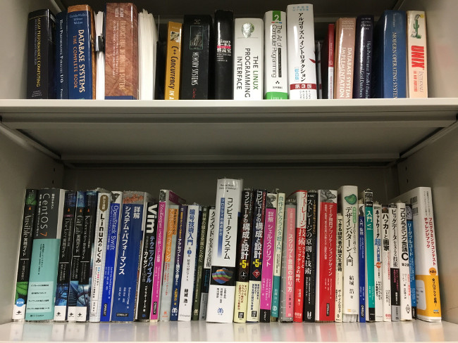

# システムソフトウェアチーム

</img>

## 研究トピック

### 建部 修見 教授
#### HPC・ビッグデータ・AIのための並列分散システムソフトウェア
HPC, ビッグデータ, AIのための並列分散システムソフトウェアの研究を行います．演算性能はGPU等の演算加速器により高速化が図られますが、ストレージ性能とのギャップが問題となっています．HPC, ビッグデータ, AIではこのギャップの解消が急務となっており、アーキテクチャ、ソフトウェアの両面から問題に取り組みます．HPC用大規模PCクラスタ、<a href="https://www.ccs.tsukuba.ac.jp/supercomputer/#Cygnus">Cygnus</a>，<a href="https://www.ccs.tsukuba.ac.jp/supercomputer/#OFP">Oakforest-PACS</a>等のスパコンを利用して研究を進めていきます．以下のビデオは以前の研究プロジェクトのハイライトです。
<iframe width="560" height="315" src="https://www.youtube.com/embed/XvcKs-c9nA8" frameborder="0" allow="autoplay; encrypted-media" allowfullscreen style="max-width: 100%"></iframe>

#### テーマの例
1. 分散ストレージシステム，バーストバッファ
演算性能とストレージ性能のギャップを埋めるため，その中間的なレイヤとしてバーストバッファの利用が注目されています．バーストバッファは，パーシステントメモリ，フラッシュデバイスなど高速なデバイスで構成されたキャッシュのようなシステムです．ただし，まだ発展途上の技術であり多くの技術課題があります．分散ストレージシステム，バーストバッファの設計，評価，高性能化を行います．本研究室では<a href=http://oss-tsukuba.org/software/gfarm>Gfarmファイルシステム</a>をベースとしたGfarm/BBバーストバッファシステムの研究開発を行うほか，新しい設計によるプロトタイピング，評価などを行っています．

1. Spark/MapReduce，並列I/Oなどのクライアントライブラリ
高速な分散ストレージ，バーストバッファを効率よく利用するためには，クライアントライブラリの設計が重要となります．パーシステントメモリ，フラッシュデバイスなどに適したライブラリの設計，拡張，高性能化を行います．本研究室では，スパコンで利用される並列I/OのライブラリMPI-IOにおいて，ノードローカルストレージを効率的に利用するための設計/実装，Sparkからオブジェクトストレージを効率よくアクセスするための設計/実装などを行っています．

1. 深層学習システムの性能評価，高性能化
TensorFlow, MXNet, Chainerなどの機械学習フレームワークにおいて，大規模なデータセットで学習を行うさい，データの読込みがボトルネックとなります．これにより，大規模なデータセットでの学習が困難なものとなっています．大規模なデータセットでの学習に対する機械学習フレームワークの性能評価，高性能化を行います．本研究室では，この読込性能のボトルネックを解消するため，バーストバッファを応用したキャッシュシステムの提案/実装を行っています．

## 研究室説明会日程
最終更新日: 2019-09-11

### 全体説明会

|日付|時間|場所|
|:---|:---|:---|
|10/ 2 (水)|16:45 ~ 18:00|総合研究棟B **1111/1112**|

### 研究室公開

|日付|時間|場所|
|:---|:---|:---|
|10/ 8 (火)|18:15 ~ 19:00|総合研究棟B 1121/1122|
|10/21 (月)|18:15 ~ 19:00|総合研究棟B 1121/1122|
|11/ 1 (金)|18:15 ~ 19:00|総合研究棟B 1121/1122|

## メンバー

<!-- |教員名|職階|研究分野に関するキーワード| -->

| 名前 | 職階 | 研究内容・メッセージ |
|:-----|:---|:-------------------------|
|[建部 修見](http://www.hpcs.cs.tsukuba.ac.jp/~tatebe/index-j.html)|教授|分散ファイルシステム, 並列システムソフトウェア システムソフトウェアに興味がある人, 大きいことをやってみたい人は是非どうぞ. 好きなことをやってください. |
|川島 英之|慶應義塾大学 准教授|データベースシステム 私は3月までHPCSシステムソフトウェアチームに所属していました．4月から慶應義塾大学に移動しましたが，現在でも共同研究をしています．このチームには，世界と戦える実力があります．私の専門分野であるデータカーネル技術においても，日本でこのチームにしかない先端的技術が多数あります．研究費は潤沢であり，設備は万全であり，建部先生は立派な方です．研究内容は，やって面白く，現実に役立ち，しかも良い就職に直結，と三拍子揃っています．興味を持ったら，ぜひ話を聞きにきてください．|
|田中 昌宏|研究員|並列分散ワークフローシステムPwrake Rakeをベースにして設計され, 分散ファイルシステムGfarmと高い親和性をもつワークフローシステムPwrakeを研究開発しています. [RubyKaigiでの講演はこちら](http://rubykaigi.org/2016/presentations/masa16tanaka.html)|
|河合 祐輔|M2|極端気象現象に関するアプリケーションの並列化と評価補助 多くの計算機があり, 非常に恵まれた環境で好きなことを研究することができます. ビッグデータ処理などに興味がある方は是非.|
| 北澤 昂大 | M2 | Gfarmとクラウドストレージによる階層型ストレージシステムの研究 この研究チームでは、多数のサーバー・スパコンを利用して新しい技術の評価を行ったり(ストレージ系・HPC用システムソフトウェア系が多いと思います)、利用者がより便利に早く利用できる裏方のシステムソフトウェアの研究開発を行ったりできます。オンプレだけでなくクラウドを触る機会も場合によってはありますし、その仕組みを知る機会が十分に与えられていると思います。今まで経験が豊富でなくて不安な人も全然大丈夫だと思いますが、この領域が好きなほうが楽しいと思います。またM2の同期を見ても、関連領域における就職状況は良いと思います。あと最短で週1の定例ミーティングがありますが、先生が穏やかなので雰囲気は良いです。 |
| 町田 健太 | M2 | この前家の鍵紛失して帰れなかったんですけど研究室のおかげで快適な一夜を過ごせました。風呂を完備してくれれば家を解約して研究室に住もうと思います。 |
| <a href='http://www.hpcs.cs.tsukuba.ac.jp/~serizawa/'>芹沢 和洋</a> | M2 | 深層学習におけるI/O高速化 深層学習の訓練処理におけるI/Oを高速化する手法について研究しています．自主性が要求される研究室だとは思いますがその分やりたいことがある人にとっては良い環境だと思います． |
| 佐藤 拓人 | M2 | 気象大規模データ解析ワークフローの提案 気象分野とのデュアルディグリープログラムです。気象学LESモデルの高性能化や, 気象学で作られる大規模データの解析に取り組んでいます。他分野とのコラボレーションもあり非常に活き活きとした環境です。 |
|澤田 一樹|M2|分散ファイルシステムにおけるノードローカルバーストバッファの活用 NVMeが大好きです。広い研究室と充実した備品で快適に研究ができます。MTがこまめにあるので意思疎通もしやすいです。|
|田辺 敬之|M2|高性能トランザクション処理, 並行性制御，ログ永続化 とても充実した環境で自己研鑽に励むことができる研究室だと思います．B4 で Hello World から始めても，一年後には世界が視界に入ってくる，そういう環境です．共に世界に挑みましょう．|
|田村 駿弥|M2|並行木構造 木構造の専門家です。好きな木構造は MassTree です．並列プログラミングに自信があります．並列プログラミング・並行木構造・C言語等に関心がある，自信がある人は熱く議論しましょう！！|
|堀江 悠樹|M2|ブロックチェーンに新たな旋風を巻き起こします。|
| 杉原 航平 | M1 | ノードローカルバーストバッファの検討 研究室の人数よりも計算機の方が多い研究室です。クラスタやスーパーコンピューターを使って研究してみたい人はぜひ！ |
| <a href='https://www.hpcs.cs.tsukuba.ac.jp/~shuuji3/'>高橋 宗史</a> | M1 | 分散オブジェクトストレージ Ceph のための Apache Spark ストレージコネクタの設計 HPCS 研究室では、多数の実験用コンピュータ (スーパーコンピュータも含む)・個人の作業スペースや周辺機器などが利用でき、快適に研究に取り組める環境が整備されています。ぜひ見学に来てください。個人の研究内容としては、卒業研究では、分散オブジェクトストレージの1種であるオープンソースソフトウェア Ceph の性能評価の行い、現在は、Ceph を活用した Apache Spark のストレージコネクタを設計し、Scala で実装したりしています。 |
| 畑中 智之 | M1 | ノードローカルストレージとNVMfの活用 / コンテナ型仮想化の利用 計算機をたくさん持っている研究室です。やりたいことを、のびのびと研究できる環境だと思います。 |
| 倉本 健 | B4 | 大規模かつ高性能な計算機を利用できます。個人では難しい「大きいこと」をやってみたい方はぜひご検討ください。 |

## 研究論文

### 論文誌
### 国際発表

1. [Skew-Aware Collective Communication for MapReduce Shuffling](https://search.ieice.org/bin/summary_advpub.php?id=2019PAP0019&category=D&lang=E&abst=)
    - Harunobu Daikoku, Hideyuki Kawashima, and Osamu Tatebe,
    - IEICE Transactions on Information and Systems, Vol.E102-D, No.12, Dec. 2019 (to appear)

1. [Integration of TicToc Concurrency Control Protocol with Parallel Write Ahead Logging Protocol](http://ijnc.org/index.php/ijnc/article/view/213)
    - Yasuhiro Nakamura, Hideyuki Kawashima, Osamu Tatebe
    - International Journal of Networking and Computing, Vol.9, No.2, pp.339-353, 2019

1. [Skew-Aware Collective Communication for MapReduce Shuffling](https://ieeexplore.ieee.org/document/8622088)
    - Harunobu Daikoku, Hideyuki Kawashima, Osamu Tatebe
    - Proceedings of the 6th Workshop on Scalable Cloud Data Management, pp.3331-3340, doi: 10.1109/BigData.2018.8622088, 2018 

1. [Integrating TicToc with Parallel Logging](https://ieeexplore.ieee.org/abstract/document/8590882)
    - Yasuhiro Nakamura, Hideyuki Kawashima, Osamu Tatebe
    - The Sixth International Symposium on Computing and Networking (CANDAR 2018)

1. [PPMDS: A Distributed Metadata Server based on Nonblocking Transactions](https://ieeexplore.ieee.org/abstract/document/8554478/)
    - Kohei Hiraga, Osamu Tatebe, Hideyuki Kawashima
    - Proceedings of the Second International Workshop on Data Science Engineering and its Applications, 2018

1. [Applying Pwrake Workflow System and Gfarm File System to Telescope Data Processing](https://ieeexplore.ieee.org/abstract/document/8514866)
    - Masahiro Tanaka, Osamu Tatebe, Hideyuki Kawashima
    - 2018 IEEE International Conference on Cluster Computing (CLUSTER), pp. 113-122, Sep. 2018.

1. [Integration of Parallel Write Ahead Logging and Cicada Concurrency Control Method](https://ieeexplore.ieee.org/abstract/document/8421375)
    - Takayuki Tanabe, Hideyuki Kawashima, Osamu Tatebe
    - 2nd IEEE International Workshop on Big Data and IoT Security in Smart Computing (BITS2018)

### 国内発表
情報処理学会HPC研究会とOS研究会に投稿した研究会原稿に関して，筑波大学は情報処理学会と機関契約をしていますので，これらの原稿は筑波大学構内のネットワークからは自由にダウンロード可能です．

1. [分散オブジェクトストレージ Ceph のための Spark ストレージアダプタの設計](http://id.nii.ac.jp/1001/00199028/)
  - 高橋宗史, 建部修見
  - 情報処理学会 第171回 HPC 研究会報告

1. [ユーザ権限におけるDockerオーケストレーションの構築と撤去](http://id.nii.ac.jp/1001/00199031/)
  - 畑中智之, 建部修見
  - 情報処理学会 第171回 HPC 研究会報告

1. [大規模ゲノムデータに対する分散並列相同性検索システムの提案]( http://id.nii.ac.jp/1001/00198078/)
  - 町田健太, 建部修見
  - 情報処理学会 第170回 HPC 研究会報告 (SWoPP 2019)

1. [Gfarmとクラウドストレージによる階層型ストレージシステムの研究](http://id.nii.ac.jp/1001/00198072/)
  - 北澤昂大, 建部修見
  - 情報処理学会 第170回 HPC 研究会報告 (SWoPP 2019)

1. [大規模機械学習訓練におけるI/O性能の高速化](http://id.nii.ac.jp/1001/00198056/)
  - 芹沢和洋, 建部修見
  - 情報処理学会 第170回 HPC 研究会報告 (SWoPP 2019)

1. [ノードローカルバーストバッファのためのMPI-IOの設計](http://id.nii.ac.jp/1001/00194704/)
  - 杉原航平, 建部修見
  - 情報処理学会 第168回 HPC 研究会報告

1. [深層ニューラルネットワークにおける訓練高速化のための自動最適化](http://id.nii.ac.jp/1001/00194707/)
  - 芹沢和洋, 建部修見
  - 情報処理学会 第168回 HPC 研究会報告

1. [並行性制御法 Cicada の評価](https://db-event.jpn.org/deim2018/data/papers/367.pdf)
  - 田辺敬之, 川島英之, 建部修見
  - 第10回データ工学と情報マネジメントに関するフォーラム, 第16回日本データベース学年次大会 (DEIM2018)

1. 並行性制御法 Cicada と並列ログ先行書き込み法 P-WAL の結合
  - 田辺敬之, 川島英之, 建部修見
  - xSIG2018, cross-disciplinary workshop on computing Systems, Infrastructures, and programming

1. [サイエンティフィックビッグデータアプリケーションのためのベンチマークセットの提案](http://id.nii.ac.jp/1001/00190557/)
  - 岩井厚樹, 建部修見
  - SWoPP2018

2017年以前は[こちら](https://www.hpcs.cs.tsukuba.ac.jp/publications/)より参照できます. 

## 日常生活

1. 週に一回，2-3時間のチームミーティングをします. ここでは簡単に進捗報告をします. また，週に一回全体ミーティングも行います．これはHPCS研究室の全チームが集まって行うミーティングです．
1. 上記以外に個別ミーティングを週に1回程度やります. ここでは一緒に論文を読んだり, 研究の方向性を考えたりします. 
1. コアタイムはありませんが, 午前中にきて夕方に帰る人が多いようです. ラボくるとなんか楽しくていいですね. 
1. 研究室内には, 電子レンジ, 冷蔵庫, 電気ポット, コーヒーメーカー, ソファ等の備品もあり, 所属している学生は自由に使用することができます. また，物販もあり，軽食・飲み物等が購入可能です．
1. 楽しいイベントが多数あります. 
1. 開発合宿を毎年やります. 
