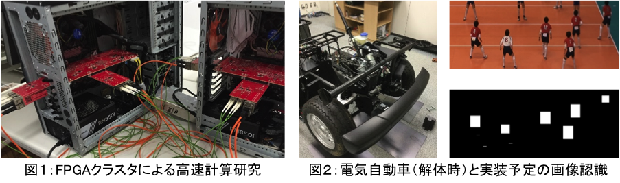

# FPGAチーム

## FPGA Team
</img>

## 研究内容

### 山口 佳樹 准教授

AI (Artificial Intelligence)、5G/IoT、BigData は、Webページやニュースなどでも、一般に利用される単語となりつつあります。これらを支える情報システムとして、膨大なデータを対象とした演算加速装置、5G/IoTを支える高速通信装置、集約されたデータを高速に取り扱うストレージ装置などがあります。では、これら全ての分野で、FPGAが注目を集めるデバイスとなっていることは知っているでしょうか？
演算加速という面では、Microsoft、IBM、Amazon、百度などがデータセンタ向けに FPGA を利用し始めています。具体的には、サーチエンジン、AI 学習、医療画像処理、遺伝子検索、流体シミュレーションなどに利用されつつあります。ネットワークという面では、GPUで有名な Nvidia が Mellanox (FPGAを利用したネットワークスイッチを製造・販売した企業）を2019年3月に買収、これに対抗して Intel が FPGA 部門とネットワーク部門の統合を2019年6月に発表しました。ストレージ装置という面では、DELL EMCや富士通などの大手メーカが FPGA の採用を決めています。このことから、FPGA は既存のITシステムを変え、ITサービスを変え、社会を変える、という人もいます。
FPGAチームは、約20年蓄積されたFPGA研究/実装/開発の経験に基づき、学術的研究に加え産業界もにらんだ実問題を対象とするハードウェア加速機構について真剣に議論します。具体的には、理化学研究所、産業技術総合研究所、高エネルギー加速器研究機構、物質材料研究機構などと共同研究を行っています。また、インターンシップや留学などの相談も可能です。興味を持った人は、研究室紹介で会いましょう。

</img>

### FPGA (Field Programmable Gate Array) チームについて

　FPGAは、自動運転、医療/福祉、ロボット、ビッグデータ、安全・安心、航空宇宙等の分野で数多くの企業が利活用しています。そしてそこでは、画像/音声検出、認識、追尾、圧縮処理、(ビッグデータ等)高速処理、大規模科学技術計算（宇宙・海洋・風洞）、暗号処理などで更なる高性能計算が求められています。また、FPGAを本当の意味で活用するために、FPGAに加え、GPUやCPUの特徴についても研究室では学んでいきます。
　日本のFPGAに関する研究および技術は高く評価され、FPGA分野の一流の国際会議を日本に誘致できるほどになっています。興味を持った人はぜひ研究室紹介に参加しましょう。

<!--
他チームとの協力
----------------
-->

## メンバー

| 名前 | 職階 | 研究内容・メッセージ |
|:-----|:---|:-------------------------|
|[山口 佳樹](https://www.lila.cs.tsukuba.ac.jp/)|准教授|リコンフィギャラブルデバイス（FPGA、DAPDNA、DRP、など）とそれを用いたシステム。 FPGAは可能性を秘めたデバイスです。そしてチームでは、Intel CPU を初め、GPGPU、ARM、GRAPE、SuperH、Cell/B.E. などのアーキテクチャについても研究を行ってきました。つまり、FPGAをただ使うのではなく、利用のメリットやデメリットをきちんと考慮した上でシステム構築できるのが他と大きく違うところです。また、基礎をきちんと押さえているため応用の幅は広く、創薬（生化学反応、遺伝子検索）、社会道徳創発、熱流体などのシミュレーションから画像処理、音声処理、機械制御、VR、AI加速機構などの実応用に近いものまで研究対象となります。興味を持った人は研究室紹介で僕と握手っ！！|
|Firmansyah IMAN|D|Systems with heterogeneous architectures, such as field programmable gate arrays (FPGAs) and graphics processing units (GPUs), are expected to boost the throughput in high-performance computing applications. However, the user may struggle to write sophisticated programs that are performed effectively on complicated heterogeneous systems. High-level synthesis (HLS) is a solution that can reduce the development time. This study focuses on the implementation of OpenCL programming as a type of HLS design on FPGA boards. The Himeno benchmark, which is a suitable benchmark for the measurement of memory-intensive applications, is chosen as a verification program. We found that the OpenCL-based implementation achieves reasonable performance on FPGAs by demonstrating the implementation of temporal blocking combined with shift register implementation simultaneously. For Stratix V DE5-Net FPGA, our current implementation achieves 10.62 GFLOPS, or 75% of the theoretical performance. Meanwhile, for Arria 10 A10PL4 FPGA, the peak performance reaches 13.95 GFLOPS, or 76% of the theoretical performance.|
|杜昌道|D|Research interests mainly focused on High-performance Computing on FPGA-based heterogeneous platforms, especially by using the High-level Synthesis methods. Currently, try to design a reusable stream program pattern for realizing scientific applications as stencils, convolution, etc. Also interested in the portability for implementing applications on different FPGA platform.|
|Riadh Ben Abdelhamid |D|2017年4月に来日しました。|
|程嘉豪|M2|人間中心社会をキーワードとした次世代 IoT プラットフォームとしてドローンというフレームワークに注目が集まっている．日本再興戦略 2016 にドローンというキーワードが登場し，経産省「平成 30 年度経済産業政策」，文科省「次世代火山研究・人材育成総合プロジェクト」，農水省「Ｇ空間プロジェクト」，また官民研究開発投資拡大プログラム（PRISM）など，様々な場所でドローンは注目技術として取り上げられている．ドローンの社会実装を考えたとき，安定飛行や特定問題への最適化に加え，消費電力効率を大きく改善する必要がある。そこで本稿では，屋内とくに工場や施設などパイプや壁面、またビル等の空調システムの検査をする屋内向けドローンについて検討することとした。|
|杜欣|M2||
|樊若冲|M2|With the increasing demand for Big Data and Machine Learning applications, these systems require a growing amount of computational power. High-performance computing systems such as data centers employ massively parallel computing, which can provide significant performance gains. While clusters with more and more nodes are built, the communication ability has become a bottleneck to the overall performance of a system. My research mainly focuses on the flexible and extensible FPGA accelerator, which is widely used in the current supercomputers and data centers. I aim to combine and improve the efficiency of the high-speed serial links and PCIe bus that most FPGA boards are provided with and provide an ideal means of communication between multiple FPGAs.|
|原澤輝|M2||
|胡子鍵|M2|With the development of self-driving, there is an increasing need of driving asistance system. I would like to build an object detection system especially applied in darkness condition, which using Tof(Time of fight) camera with an embeded FPGA zynq-7000. An improved algorithm based on HOG is introduced in this researh, which could do human detection based on depth data captured by Tof camera. FPGA itself has the advantage of processing large-scale computing caused by HOG algorithm.I hope that this research would be helpful in the coming future.|
|譚煜希|M2|In the current, there are many sophisticated many-core processors, and it is tackling to achieve a dramatic improvement in energy efficiency. However, the dependence on the straightforward extension of a SISD (single instruction single data) manner called SIMD and MIMD may impair the future growth of ICT systems because a many-core processor is composed of multiple modules working independently. In other words, the current system is still a mosaic of processor cores framed by the extension of a SISD manner. In order to achieve highly energy-efficient computing, each processing core should work integrally with others. Our research proposes a DIMD (dual-instruction multiple-data) architecture for a many-core RISC-V based processor. In the proposed processor, all the processing cores are controlled by one single sequencer node and therefore work synchronously with other cores. However, different instructions are issued to achieve highly efficient computing. The function was realized as an extension of RISC-V ISA, and our experimental results imply the hardware overhead can be ignored.  The performance of proposed DIMD architecture is double of that of SIMD architecture.|
|梅津直弥|M2|近年、高性能計算機にFPGAを組み合わせることによる、さらなる計算性能の向上事例が多数報告されています。しかし、ストレージ部の性能向上は十分とは言えず、場合によってはボトルネックとなってしまいます。そこで、FPGAを用いて、既存のストレージデバイスを多数並列に接続することにより、低遅延を維持しつつ、高いスループットのストレージシステムを構築し、上記の問題の解決を図ります。対象のストレージデバイスから、FPGA上の信号まで、幅広い知識を扱っていく手応えを感じられます。|
|牛若光太|M2|私はリアルタイム性を持った高品質映像伝送システムを実現するために、画像のストリームデータを高速で圧縮・復調する手法の提案とハードウェア実装を研究しています。画像データをFPGAで扱うメリットはセンサから伝送されたデータに対しすぐに処理できる即応性やパイプライン化が容易なことです（処理内容による）。ハードウェア設計はソフトウェア設計に比べ時間もかかり柔軟性も欠けますが、ソフトウェアでの処理を回路での処理に落とし込んで設計通りに動作してくれたときにはやりがいを感じます。FPGAチームではやりたいことを尊重してくれます。ハードウェアの知識がなくても教授にやりたいことを言えばFPGAに関連するよう議論してくださるので積極的にやりたいことをぶつけてみてください。|
|呉思卿|M2|Research discusses Power  Packet system, a power management, which using FPGA as controller to achieve the purpose of controlling the energy flow and distributing. The Power Packet has the framework of digitized power transmission, which is the basic unit, includes the transmission power and its destination.  It mimics internet transaction protocols like TCP/IP that add a communication mechanism between the source.|
|古川和輝|M1|ハードウェア記述言語Verilog-HDLを用いた回路設計をFPGA上に行うことで，科学技術計算の高速化を目指しています．具体的なアプリケーションとしては，筑波大学計算科学研究センターで開発されている，天体現象解明のために重要なシミュレーションコードです．やりがいとしては，FPGAだけでなくGPUやCPUのアーキテクチャ，DDR4 SDRAMやHBM2など最新のメモリシステムの特徴を理解することが求められていることや，輻射輸送方程式の性質を理解してソフトウェア言語だけでなくハードウェア記述言語に落とし込むことへの達成感などが挙げられると思います．|
|伊藤瑞基|M1||
|小林駿也|M1|交通標識の認識について研究を進めていて手法は色空間を用いた認識です。なぜ流行の機械学習を使わないかと思うかもしれませんが、流行の技術は誰かが勝手にやってくれます。そのため自分は他の人があまりやらなくなってしまっている色空間での認識をめざしています。現在はソフトウェア上での検証を行っていて、最終的にFPGAでの実装を目指しています。|
|新開裕|M1|FPGAと複数の６軸センサを利用したリアルタイム慣性航法の研究を行っています。場所による制限を設けないよう、小型のFPGAによる実装を目標とし、複雑なフィルタを用いない補正方法を考えています。|
|庭瀬稜平|M1|FPGA (Xilinx Virtex UltraScale+) の高速シリアル通信を使用して分散コンピューティングへ応用するための通信網の構築を行う研究を進めています。|
|中井榛希|M1|学部時代は他大学でしたが，4月より本学に入学しました．研究テーマは，FPGAを用いた，RDFに対するSPARQL問い合わせの高速化機構です．RDFとは，主語・述語・目的語からなるトリプルを1単位とする，有向グラフを表現できるようなデータ構造です．リレーショナルデータベースに対してSQLで問い合わせるのと同様に，RDFデータベースに対する問い合わせ言語も存在し，これをSPARQLといいます．SPARQL問い合わせを処理する際には，フィルタやJOINといった多くのメモリアクセスが発生する計算が必要です．FPGA(やASIC)を用いると，このようなメモリに大量に・独特のパターンでアクセスするような演算を処理する機構として，CPU(ノイマン型アーキテクチャ)よりも有利なものを作れることがあります．このような機構を実装することを目標として研究中です．実装にあたっては，HBMという広帯域なメモリを積んだ，Xilinx社のAlveo U280というPCI接続のFPGAアクセラレータカードを利用予定です．|
|程詩茹|M1|パワーパケットシステムに基づく電力管理により、ルーター制御モジュールの効率が向上し、過剰な電力消費が削減されます。 制御モジュールを実装するためのコントローラーとしてFPGAを使用します|
|康博文|M1|自動車は移動・輸送の手段として、人々の日常生活と経済活動を支援している。近年では運転支援、すなわち自動運転技術などが強く求められている。ドライビングシミュレータの精度は向上する為に、多視点カメラと実時間映像処理は必要である。この研究は4台のカメラを持つFPGA（Field Programmable Gate Array）によって、4ｋ画像を処理する研究である。|
|張晨光|M1|無人機産業は科学研究、農業、電力、輸送、気象学などの幅広い産業をカバーする新興のハイテク産業です。AIの開発に伴い、自動操縦可能な無人機の研究も検討されています。手動の無人機は通常GPSを利用して航行しています、室内での飛行は制限されています。AI制御ドローンはGPSの制限を破ることができます。同時に、AI駆動の無人機も完全に自律的な無人機であるため、無人機には外部測位や外部コンピューター制御はなく、最適な飛行経路を選択するだけで飛行制御がより正確になります。私の研究の目的は、カメラを介して信号を受信し、FPGAを介してそれらを処理し、手動操作とGPS測位は受け入れられず、無人機が自動的に飛行できることを実現することです。|
|張曦|M1|近年、スポーツ分野における運動技能向上を目的とした様々なアプリケーショが開発され、選手の位置や番号や動きなどに基づき、試合のデータを解析することが盛んに行われている。背番号はユニフォームの背中に識別できる番号として、スポーツ選手の個人情報が含まれ、試合競技の戦術解析や戦術プランニングで重要な役割を果たす。しかし、既存システムはデータ収集作業およびデータ解析作業をリアルタイム処理することは難しく、オフラインで処理することが多い。また、画像認識の演算処理は非常に資源がかかる問題とバッテリー使用時、連続使用時間が限られる問題がある。そこで、本研究では小規模FPGAを用いた、スポーツ映像に基づき、選手位置情報を収集し、その動作履歴をテキストデータ化し、背番号を認識するシステムの構築について提案する。|
|宋雨純|M1|RDFは、XML言語に基づいて、W3Cによって提案されたネットワークリソース記述標準であり、主語、述語、目的語で構成されるトリプルです。SPARQLはW3C標準化された問合せ言語で、この問合せ言語を利用してデータベースを通してデータを検索できます。膨大のデータがある現在、ソフトウェアでデータを検索すると、データの読み取り速度とクエリ操作の演算速度を向上させる余地が大量にあります。データ量が大きいほど、検査速度が低速になってしまいます。そこで自分の研究には、FPGA を利用したハードウェアアルゴリズムによるデータストアの方法を導入します。|
|徐棟宇|M1|セルフドライブが実現するために、夜間走行は重要な課題であり、早急に解決する必要があります。 tofカメラを追加することで、光が不足した場合の画像取得の問題を効果的に解決できます。私の研究は、FPGAに基づいて、tofカメラによって取得された画像データを制御および処理して、使用可能な夜間運転画像を取得することです。|
|高琦翔|M1|RISC-V ISA, mircoarchitecture, and single/multicore performance; FPGA implementation and optimization.|
|小堀泰雅|B4|カメラ映像のストリームデータを投影系に合わせて高速で補正するためにFPGAを用いた画像処理の研究をしています。|
|中川諒|B4|私はドローンで撮影した画像から深度マップを作成し、農作物の育成状況調査に応用する研究をしています。最終的には省電力を特徴とする新しいアーキテクチャの「原子スイッチFPGA」に実装する予定です。このような組み込みを想定したテーマでは、SPIやI2Cといったインタフェースや電子回路の知識など、高性能計算とは一味違うFPGAの世界を知ることができます。|
|謝靖函|研究生||
|顾超渊|研究生||
|陶毅寧|研究生|大学院を進学ために頑張ります|
|郭氷潔|研究生||
|馬文軒|研究生|大学院入学を目指して頑張ります。||

## 研究室紹介

| 日付 | 時間 | 場所 |
|:-----|:---|:-------------------------|
|10/8(木)|15:15~16:30|SB1112 (MS Teamsでも実施)|
|10/15(木)|15:15~16:30|SB1112 (MS Teamsでも実施)|
|10/21(水)|15:15~16:30|SB1112 (MS Teamsでも実施)||
MS Teamsでの参加には次のURLよりアクセス登録が必要となります。
https://teams.microsoft.com/l/team/19%3a4bcd7dd69b064015b9b3889aeaf13245%40thread.tacv2/conversations?groupId=6ab484fa-a60e-478d-894d-477cd6666044&tenantId=9e5b5dfd-669d-4ef8-b240-4229cbf4a83d

<!--
近年の研究成果について
----------------------

一例として，今年 (2016年) に情報処理学会HPC研究会に投稿した研究会原稿 (日本語) を紹介します．
筑波大学は情報処理学会と機関契約をしていますので，筑波大学構内のネットワークからは自由にダウンロード可能です．
-->

## 近年の活動
### 受賞
- 2019年09月　　ESS2019で、長岡が、研究奨励賞を受賞しました
- 2019年03月　　第81回情報処理学会全国大会で、紀野国が、学生奨励賞を受賞しました
- 2019年03月　　第81回情報処理学会全国大会で、敖が、学生奨励賞を受賞しました
- 2017年09月　　RECONF研究会で、中村が、優秀講演賞を受賞しました
- 2016年09月　　FIT2017で、中野が、FITヤングリサーチャー賞を受賞しました。
- 2016年09月　　FIT2017で、高山が、FIT2016奨励賞を受賞しました。
- 2016年09月　　FIT2017で、中野が、FIT2016奨励賞を受賞しました。

<!--
### 報道 ###

・07/28　　バレーボールシステムの研究が日経産業新聞様の先端技術面で紹介されました。

### 出版 ###
・04/22　　[FPGAの原理と構成](http://shop.ohmsha.co.jp/shopdetail/000000004588/)が出版されました。山口先生が第7章の応用事例紹介を担当されました。      
　　　- "FPGAの原理と構成", 第7章 PLD/FPGAの応用事例, オーム社, p.209-245, 2016年4月．
-->
