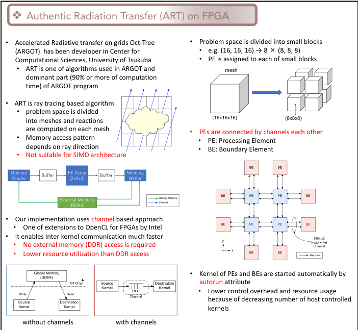

アーキテクチャチーム
==================

アーキテクチャチーム
------------
</img>


研究内容
--------

アーキテクチャチームでは，GPUやメニーコアプロセッサ等の演算加速装置をより有効に大規模並列処理に活用する手法や，超高性能並列処理向けネットワーク，さらにこれらを活用する高性能並列コンパイラの研究をしています．
現在の主な研究テーマは以下の通りです．なお，朴及び小林，藤田の3名が共同で適宜指導を行いますが，研究室配属時点では主なテーマに応じてどちらかの教員を指導教員として選択して下さい．募集人数は朴教授が**3**名，小林助教が**2**名，藤田助教が**1**名でです．

+ FPGAを用いた演算オフローディングと高速通信の融合に関する研究
+ 大規模メニーコアシステムを用いた超並列アプリケーションの実装と最適化に関する研究（朴）
+ FPGAを用いた高速ソーティング回路に関する研究
+ GPUクラスタに向けた並列プログラミング言語に関する研究
+ 次世代スーパーコンピュータの性能予測シミュレータに関する研究

以下に，所属している学生達が行っている研究テーマについて紹介します．

### GPU-FPGA複合システムにおけるデバイス間連携機構

```
キーワード: GPGPU, FPGA, デバイス間連携機構
```


我々は，高い演算性能とメモリバンド幅を有する GPU (Graphics Processing Unit) に演算通信性能に優れている FPGA (Field Programmable Gate Array) を連携させ，双方を相補的に利用する GPU-FPGA 複合システムに関する研究を進めています．
我々が提案しているAiS(Accelerator in Switch) というコンセプトでは，FPGAを高速通信のできる再構成可能な演算加速装置として捉え，CPU-GPU クラスタ構成である現在のHPC システムの性能を更に向上させる鍵であると考えています．GPUとFPGAを組み合わせた世界初のスーパーコンピュータCygnus (左図) を用いて，実用的なアプリケーションをターゲットにした提案手法の実験を行っています．

右図に AiS コンセプトの概要を示します．各ノードには GPU と FPGA が搭載されており，それらは PCIe バスを介して接続されています．アプリケーションにおける大規模な粗粒度並列処理部分は従来通り GPU が担当しつつ，GPU ではカバーできない並列性の低い演算部分のオフロードおよび高速ノード間通信処理に FPGA を適用することによって，より効率的でレイテンシボトルネックの少ない強スケーリングの実現を目指しています．


### 高性能なFPGAアクセラレータを利用したアプリケーション開発に関する研究

    キーワード: FPGA, OpenCL, FPGAと高性能計算

近年，再構成可能ハードウェアとしてFPGAが注目され，多くの分野で使われるようになってきました．高性能計算においてもその流れがあり，我々は現在利用されているGPUやCPUがどうしても解決できない問題について，FPGAを用いることで高性能化・高速化が行えないか検討しています．また，CPU, GPUに加え，FPGAにおいてもOpenCLプラットフォーム (右図) がサポートされ，FPGAを用いたプログラミングが従来よりも格段に容易になったこともその流れを後押ししています．
このOpenCLの記述能力をフルに活用して，プログラミングコストを削減しつつ高性能なFPGAアクセラレータを実現することを目指しています．その一環として，初期宇宙の研究に重要な輻射輸送を解くプログラムで用いられているアルゴリズムをOpenCLで記述してFPGA向けに最適化する研究を本学の計算科学研究センターに所属する宇宙物理の研究者と共同で実施しています．



<!--
### GPU等の演算加速装置を含む並列処理アーキテクチャ及びネットワークに関する研究と，これらのシステムを効率的に利用するための並列プログラミング言語及びコンパイラに関する研究

    キーワード: GPGPU, FPGA, 大規模並列システムとネットワーク

Graphics Processing Unit (GPU) は，演算加速装置として高く注目されており，NVIDIA社のCUDAやKhronos GroupのOpenCLなどが実行プラットフォームとしてあります．
中でも，特にNVIDIA社のCUDAは高性能計算において広く利用され，筑波大学にもGPUを用いた大規模クラスタとして[HA-PACS/TCA](https://www.ccs.tsukuba.ac.jp/research/research_promotion/project/ha-pacs)が平成29年3月まで稼働していました．

しかしながらGPUはその特性上，GPU単体で通信を行うことができず，CPUによる操作が必要となります．
そのため，我々はTightly Coupled Accelerators (TCA) というコンセプトの元，FPGAでGPU間直接通信機構PEACH2を開発し，性能評価を行っています．
また，ソフトウェア側のアプローチとして，GPUプログラミングを簡単化するためにGPU間セルフ通信機構を提案しています．
GPUはその特性上，CPUによる操作が必要なることは既に述べましたが，これはプログラミングが複雑化することと同義です．
そこで我々は並列プログラミングを簡単にするため，並列プログラミング言語に関する研究も行っています．

-->


世界的な活動
----------------
朴教授は国際会議における議長やプログラム委員長を務めるなど、世界的に活躍しています．また，小林助教も国際会議のプログラム委員の経験があります．

<iframe width="560" height="315" src="https://www.youtube.com/embed/zT1BKPU8VVk?start=1" frameborder="0" allow="accelerometer; autoplay; clipboard-write; encrypted-media; gyroscope; picture-in-picture" allowfullscreen></iframe>

<iframe width="560" height="315" src="https://www.youtube.com/embed/RgADPWRNBgM" frameborder="0" allow="accelerometer; autoplay; clipboard-write; encrypted-media; gyroscope; picture-in-picture" allowfullscreen></iframe>

<iframe width="560" height="315" src="https://www.youtube.com/embed/BDPsa7AP7NA" frameborder="0" allow="accelerometer; autoplay; clipboard-write; encrypted-media; gyroscope; picture-in-picture" allowfullscreen></iframe>

他チームとの協力
----------------

並列プログラミング言語に関する研究は[PAチーム](pateam.md)との共同研究で，我々のPEACH2をPAチームで開発している並列言語XcalableMPの演算加速装置向け拡張XcalableACCに導入した実績もあります．
また，[FPGAチーム](fpgateam.md)とも協力しFPGAの基礎評価や並列アプリケーションの実装などを行っています．


メンバー
----------------

| <span style="display: inline-block; width: 6em;">名前</span> | <span style="display: inline-block; width: 3em;">職階</span> | 研究内容・メッセージ |
|:---|:---|:-------------------------|
|[朴 泰祐](http://www.hpcs.cs.tsukuba.ac.jp/~taisuke/)|教授|<font color="green">アクセラレータ, ネットワーク</font><br>大規模科学技術計算（計算科学）は，最先端のサイエンスを支える重要な研究であり，我々は本学の[計算科学研究センター](http://www.ccs.tsukuba.ac.jp/)を始めとする国内外の研究者との共同研究によってこれを実施しています．GPU，FPGA等の計算リソースは今後の同分野の研究推進に重要な要素であり，これらを積極的に用いた大規模計算科学の実質的な成果を目指した研究を日夜進めています．ぜひみなさんの若い力を貸して下さい！|
|[小林 諒平](https://sites.google.com/site/ryokbya/)|助教|<font color="green">GPU, FPGA, アクセラレータ, 高性能インターコネクト</font><br>FPGAを使って自分だけの高性能ハードウェアを作ってみたい，高性能ハードウェアを簡単に作れる素敵なツールを実装してみたい，FPGAだけじゃなく，CPU, GPUを含めたヘテロジニアスコンピューティングについて探求したいという人は間違いなく当研究室に向いているので，どうぞ見学においで下さい．当研究室は，世界の第一線で活躍されている先生方を多く抱え，かつ学外の一流の研究者とも連携することができ，研究をするにおいてこれ以上無いくらい理想的な環境が用意されています．是非一緒に世界を獲る研究を行っていきましょう！[(詳細)](kobayashi.pdf) [(TSUKUBA FUTUREの記事)](http://www.tsukuba.ac.jp/notes/091/index.html)|
|藤田 典久|助教|<font color="green">GPU, FPGA, アクセラレータ</font><br>大規模な科学技術計算にFPGAを適用する研究をしています。FPGA向けのアプリケーション最適化に関する研究だけでなく、FPGAが持つ高速な外部通信機構を用いて複数のFPGA間で通信し、大規模な問題を複数のFPGAで並列に計算をする研究も行っています。現在のFPGAは開発コストが高く、なかなか一筋縄にはいきませんが、CPUや他のアクセラレータでは実現できない処理がFPGAでは可能であり、将来性のあるデバイスであると考えています。そして何よりも、研究成果が出たときの達成感と喜びは格別です。最近ではフランクフルトで開催された国際会議で[HPC in ASIA poster award](https://www.ccs.tsukuba.ac.jp/award20180627/)を受賞しました。これ以外にも本研究室の研究内容は世界的に評価されているので，「**何か凄いことをして世界中の注目を集めてみたい！**」とこっそり思っている人にとって本研究室はまさに理想的な環境です。1ミリでも興味を持ったら是非遊びに来て下さい！|
|綱島 隆太|D1|<font color="green">FPGA, GPU, アクセラレータ, OpenACC</font><br>この研究室では、TCAコンセプトを発展させたAiSという新しいコンセプトのアーキテクチャを実現すべく、従来の計算主体であるGPUが苦手な処理をFPGAで行えるようにするために、GPUメモリ上の計算データをFPGAでも処理する技術を研究しています。しかし、この技術を使うには、現状CPU、GPU、FPGAそれぞれの処理を別々の言語で書かなければならないというアプリ開発者にとって深刻な問題があります。これをすべて一つの言語で書けるようにするために、私はOpenACCというOpenMPのようなディレクティブ言語で記述できるプログラミング環境を実現しようとしています。そのために、OpenACCのコンパイラを実装する研究をしています。また、この研究は国際共同研究であり、米国オークリッジ国立研究所および理研と協力しています。|
|柏野 隆太|M1|<font color="green">GPU, FPGA</font><br>HPCS研究室Architectureチームでは，PPX(Pre-PACS-X)と呼ばれる共有マシンを自由に使用することができます．PPXには100万円を超えるFPGAやGPUが数多く搭載されており，これらのデバイスを気軽に使用することができます．また，HPCS研究室には数多くの先生方がおり，国際的にも大変活躍されています．そんな先生方からアドバイスがもらえる研究室です．<br>HPCに興味のある方・高価なデバイスを使い倒してみたい方は，ぜひ研究室にお越しください．|
|渡邉孔英|M1|<font color="green">FPGA</font><br>現在は並列プログラミングについて学び、研究へ向けて準備を進めています。人もモノも揃っていて、研究に打ち込める環境が整っています。気になる方は、ぜひお越しください。|
|菊池 航平|B4|<font color="green">GPU</font><br>今年の春からArchitectureチームに配属されました。高性能なGPUやFPGAを搭載したマシンを自由に使用でき、他にも研究室の設備や他チームのメンバーなどの研究の環境が非常に充実している研究室です。今は動かしたいモノがない方も、環境から刺激を受けることができるかもしれません。高性能計算に興味のある方はぜひお越しください。
近年の研究成果
----------------------
1. Performance Evaluation of Pipelined Communication Combined with Computation in OpenCL Programming on FPGA
    - Norihisa Fujita, Ryohei Kobayashi, Yoshiki Yamaguchi, Tomohiro Ueno, Kentaro Sano, Taisuke Boku
    - 2020 IEEE International Parallel and Distributed Processing Symposium Workshops (IPDPSW)/pp.450-459, 2020-07

1. Accelerating Radiative Transfer Simulation with GPU-FPGA Cooperative Computation
    - Ryohei Kobayashi, Norihisa Fujita, Yoshiki Yamaguchi, Taisuke Boku, Kohji Yoshikawa, Makito Abe, Masayuki Umemura
    - 2020 IEEE 31st International Conference on Application-specific Systems, Architectures and Processors (ASAP)/pp.9-16, 2020-07

1. OpenCL-Enabled GPU–FPGA Accelerated Computing with Inter-FPGA Communication
    - Ryohei Kobayashi, Norihisa Fujita, Yoshiki Yamaguchi, Ayumi Nakamichi, Taisuke Boku
    - Proceedings of the International Conference on High Performance Computing in Asia-Pacific Region Workshops/pp.17-20, 2020-01

1. 再構成可能なハードウェアを用いた演算と通信を融合する手法の提案と性能評価
   - 藤田 典久，小林 諒平，山口 佳樹，朴 泰祐（筑波大学）
   - 第171回HPC研究発表会-情報処理学会 (2019/09/20, 国立情報学研究所 12F会議室)
2. 宇宙輻射輸送コードにおけるOpenCLによるFPGA演算加速最適化
   - 藤田 典久, 小林 諒平, 山口 佳樹, 朴 泰祐, 吉川 耕司, 安部 牧人, 梅村 雅之
   - 情報処理学会論文誌コンピューティングシステム（ACS）, Vol. 12, No.3, pp. 64-75, 2019.
3. ストリーム計算による最適化を併用するFPGA向けOpenMPコンパイラの試作
   - 渡部 裕(筑波大), 李 珍泌, 佐野 健太郎(理研), 朴 泰祐(筑波大), 佐藤 三久(理研)
   - SWoPP2019 (2019/07/24-07/26, 北見)
4. OpenCL対応FPGA間通信機能によるGPU・FPGA複合型演算加速
   - 小林 諒平, 藤田 典久, 山口 佳樹, 中道 安祐未, 朴 泰祐(筑波大)
   - SWoPP2019 (2019/07/24-07/26, 北見)
5. GPU・FPGA複合演算加速による輻射流体シミュレーションコードARGOTの実装
   - 中道 安祐未, 藤田 典久, 小林 諒平, 朴 泰祐, 吉川 耕司, 梅村 雅之(筑波大)
   - SWoPP2019 (2019/07/24-07/26, 北見)
6. 都市気象コードCity-LESの並列GPU実装の最適化と性能評価
   - 辻 大亮, 多田野 寛人, 朴 泰祐, 池田 亮作, 佐藤 拓人, 日下 博幸(筑波大)
   - SWoPP2019 (2019/07/24-07/26, 北見)
7. Parallel Processing on FPGA Combining Computation and Communication in OpenCL Programming
   - Norihisa Fujita, Ryohei Kobayashi, Yoshiki Yamaguchi and Taisuke Boku
   - Proc. of AsHES2019 (Int. Workshop on Acceleraors and Hybrid Exascale Systems) in IPDPS 2019, Rio de Janeiro, May 2019.
8. GPU-FPGA Heterogeneous Computing with OpenCL-enabled Direct Memory Access
   - Ryohei Kobayashi, Norihisa Fujita, Yoshiki Yamaguchi, Ayumi Nakamichi and Taisuke Boku
   - Proc. of AsHES2019 (Int. Workshop on Acceleraors and Hybrid Exascale Systems) in IPDPS 2019, Rio de Janeiro, May 2019.
9. GPU-FPGA協調計算を記述するためのプログラミング環境に関する研究
   - 綱島 隆太，小林 諒平，藤田 典久，中道 安祐未，朴 泰祐（筑波大学）
   - 第169回ハイパフォーマンスコンピューティング研究発表会 (2019/05/10)
10. AVX-512 Intrinsicsで実装されたステンシル計算のScalable Vector Extensionへの展開
    - 廣川 祐太，朴 泰祐，矢花 一浩（筑波大）
    - 第168回ハイパフォーマンスコンピューティング研究発表会 (2019/03/05-03/07, 山代温泉)
11. 都市気象LESコードの並列GPU環境における高速化
    - 辻 大亮，多田野 寛人，朴 泰祐，池田 亮作，佐藤 拓人，日下 博幸（筑波大）
    - 第168回ハイパフォーマンスコンピューティング研究発表会 (2019/03/05-03/07, 山代温泉)
12. GPU・FPGA混載ノードにおけるヘテロ演算加速プログラム環境に関する研究
    - 中道 安祐未，小林 諒平，藤田 典久，朴 泰祐（筑波大）
    - 第168回ハイパフォーマンスコンピューティング研究発表会 (2019/03/05-03/07, 山代温泉)
13. FPGAへのオフロード最適化のためのSPGenとOpenCLの統合の検討
    - 渡部 裕（筑波大），李 珍泌，佐野 健太郎（理研），朴 泰祐（筑波大），佐藤 三久（理研 / 筑波大）
    - 第168回ハイパフォーマンスコンピューティング研究発表会 (2019/03/05-03/07, 山代温泉)
14. OpenCL-enabled high performance direct memory access for GPU-FPGA cooperative computation
    - Ryohei Kobayashi, Norihisa Fujita, Yoshiki Yamaguchi, Taisuke Boku
    - Proc. of IXPUG Workshop Asia 2019 (in HPC Asia 2019), Guangzhou, Jan. 14th, 2019.
15. Trade-off of offloading to FPGA in OpenMP Task-based programming
    - Yutaka Watanabe, Jinpil Lee, Taisuke Boku, Mitsuhisa Sato
    - Proc. of Int. Workshop on OpenMP 2018 (IWOMP2018), 12 pages, Barcelona, Sep. 2018.


