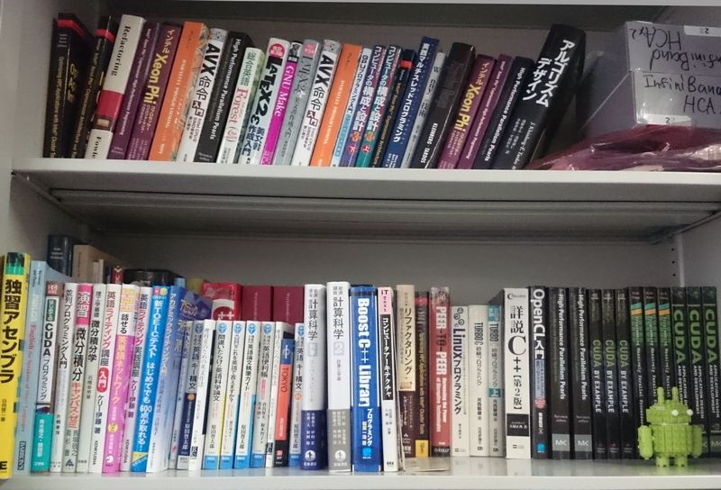

アルゴリズムチーム
==================

<!--
チーム概要
----------
-->

研究内容
--------

### 高橋 大介 教授 ###

　アルゴリズムチーム高橋の下では、限られた時間の中で大規模な科学技術計算を行うために、スーパーコンピュータの性能をできるだけ発揮できるようなアルゴリズムやプログラミングに関する研究を行っています。卒業研究では、

    1. 高性能並列数値計算ソフトウェア
    2. GPUやメニーコアプロセッサなどを用いた高性能計算
    3. 高精度計算アルゴリズムとその応用

などのテーマに取り組みます。もちろん、上記以外のテーマに取り組んで頂くことも可能です。
　高速なプログラムを作成するには、コンピュータの仕組みや数学について深い理解が必要になりますが、努力が性能という数字にそのまま反映されることから、やりがいがある分野です。

### 多田野 寛人 助教 ###

　アルゴリズムチーム多田野の下では，数値線形代数に関するアルゴリズム開発を行っています．卒業研究では,

    1. 大規模連立一次方程式の高速・高精度・高信頼性アルゴリズムの構築
    2. 連立一次方程式の求解高速化のための前処理法の開発
    3. 上記開発手法の実問題への応用、及び並列化による高性能化

などのテーマに取り組みます。これ以外のテーマに取り組むことも可能です。
　配属された学生さんには専用のPCが割り当てられ、MATLABやFortranなどでプログラムを組んで研究を行っていきます。数学やプログラミングが苦手でもしっかり指導しますので、心配はいりません。少しでも興味がありましたら、ぜひ説明会に来てみてください。

### アルゴリズムチームの使っている計算機について ###

<!--
　研究室で所有している計算機としては、一般的なCPUを搭載した4ノードおよび8ノードのクラスタのほか、GPUを搭載した4ノードのクラスタ、メニーコアプロセッサの[Intel Xeon Phi](https://www.intel.co.jp/content/www/jp/ja/products/processors/xeon-phi/xeon-phi-processors.html)（通称MIC）を搭載した4ノードのクラスタがあります。これらは学生によって管理・運用されていて自由に使うことができます。 また本研究室は[計算科学研究センター](http://www.ccs.tsukuba.ac.jp)と協力関係にあり、研究内容によっては筑波大学と東京大学が共同運営する最先端共同HPC基盤施設のスーパーコンピュータ[Oakforest-PACS](http://jcahpc.jp/ofp/ofp_intro.html)や、筑波大学のスーパーコンピュータ[COMA](https://www.ccs.tsukuba.ac.jp/supercomputer/#COMA)を利用できます。Oakforest-PACSは2016年の12月から運用が開始された総ピーク演算性能が25ペタフロップスに達する大規模なXeon Phiクラスタ、COMAは2014年の4月から運用が開始された総ピーク演算性能1.001ペタフロップスに達する大規模なMICクラスタであり、多数のノードを使用した大規模な計算を行うことが可能です。これらの様々な計算機資源を利用して研究を行うことが可能です。個人では手に入れられないような計算機で自分のプログラムを走らせてみませんか？ 
-->
<!--
　チームで所有している計算機としては、IntelのXeonプロセッサを搭載した4ノードおよび8ノードのクラスタのほか、IntelのXeon Phiプロセッサを搭載した4ノードのクラスタがあります。これらは学生によって管理・運用されていて自由に使うことができます。また本研究室は[計算科学研究センター](https://www.ccs.tsukuba.ac.jp)と協力関係にあり、研究内容によってはスーパーコンピュータ[Oakforest-PACS](https://www.cc.u-tokyo.ac.jp/supercomputer/ofp/service) (理論ピーク性能25PFLOPS)や[Cygnus](http://www.ccs.tsukuba.ac.jp/supercomputer/#Cygnus) (理論ピーク性能2.4PFLOPS)を利用できます。これらの様々な計算機資源を利用して研究を行うことが可能です。
-->
　チームで所有している計算機としては、IntelのXeonプロセッサを搭載した4ノードのクラスタ2つのほか、IntelのXeon Phiプロセッサを搭載した4ノードのクラスタがあります。これらは学生によって管理・運用されていて自由に使うことができます。また本研究室は[計算科学研究センター](https://www.ccs.tsukuba.ac.jp/)と協力関係にあり、研究内容によっては筑波大学が運用するスーパーコンピュータ[Cygnus](https://www.ccs.tsukuba.ac.jp/supercomputer/#Cygnus) (理論ピーク性能2.4PFLOPS) を利用できます。これらの様々な計算機資源を利用して研究を行うことが可能です。

### FFT (高速フーリエ変換)
高橋教授の研究内容のひとつであるFFTをご紹介します。
<iframe width="560" height="315" src="https://www.youtube.com/embed/GPJx5JTGQEU" frameborder="0" allowfullscreen></iframe>

<!--
他チームとの協力
----------------
-->

メンバー
----------------

| 名前 | 職階 | 研究内容・メッセージ |
|:-----|:---|:-------------------------|
|[高橋 大介](https://www.hpcs.cs.tsukuba.ac.jp/~daisuke/)|教授|数値計算, メニーコア, アクセラレータ 限られた時間の中で大規模なシミュレーションを行うために、スーパーコンピュータの性能をできるだけ発揮できるようなアルゴリズムやプログラミングに関する研究を行っています。高速なプログラムを作成するには、コンピュータの仕組みや数学について深い理解が必要になりますが、努力が性能という数字にそのまま反映されることから、やりがいがある分野です。|
|[多田野 寛人](https://www.hpcs.cs.tsukuba.ac.jp/~tadano/)|助教|線形方程式, 数値計算 当グループでは，数値線形代数に関するアルゴリズム開発を行っています．数値線形代数という研究分野は聞き慣れない方も多いと思いますが，　コンピュータを用いて大規模な連立一次方程式などを解く，といったことを行っています．そんなことをやって一体何の役に立つのか？と感じる方もいると思いますが，コンピュータで様々な現象のシミュレーションを行う際には多くの場面で大規模な連立一次方程式などが現れることから，必要不可欠な基盤技術となっています．みなさんもいろんな分野で役に立つアルゴリズムを研究してみませんか？|
|石川 翔大|M2|Saddle Point Problem型の連立一次方程式に対する解法 鞍点問題型の連立一次方程式の高速な求解手法について研究をしています。連立一次方程式について１から勉強したい方は当グループを強くお勧めします。|
|Nam Woon|M2||
|杉﨑 行優|M2|魔法列の数え上げ スーパーコンピュータで大規模かつ効率的に計算をするには、ハードウェアから数学まで幅広い知識が必要になります。弊研究室の先生方は様々な分野においてトップレベルであり、詳細で手厚いサポートを期待できます。コンピュータの性能を極限まで引き出したい、プロセッサのパイプラインを命令で埋め尽くしたいという方は弊チームにぜひお越しください！|
|菅沼 夏樹|M1|複数右辺連立一次方程式の高速・高精度数値解法 疎行列を係数とするような連立一次方程式の，高速で高精度な求解法について研究を行っています．研究室所有のワークステーションや，申請をすればスパコンも利用できるため，高性能なシステムでの高速化に興味がある方にはおすすめできる研究室です．|
|大滝 恒輝|M1|マルチGPUによる流体力学計算の高速化 銀河形成シミュレーションの計算時間のうち大部分を流体力学計算が占めています。この流体力学計算をマルチGPU向けに実装し、高速化することについて研究しています。私は物理学類出身で知識が少なかったですが、先生・先輩から多くのアドバイスをいただくことで、たのしく研究しています。|
|市塚 勇正|B4||
|落道 智也|B4||
|山口 博將|B4||

近年の研究成果について
----------------------

一例として，昨年 (2020年) までに国際学会，情報処理学会HPC研究会等に投稿した研究会原稿を紹介します．
筑波大学は情報処理学会と機関契約をしていますので，筑波大学構内のネットワークからは自由にダウンロード可能です．

1. A Rapid Euclidean Norm Calculation Algorithm that Reduces Overflow and Underflow
    - 原山 赳幸, 工藤 周平, 椋木 大地, 今村 俊幸, 高橋 大介
    - Proc. 21st International Conference on Computational Science and Its Applications (ICCSA 2021)
    - https://doi.org/10.1007/978-3-030-86653-2_7
1. オーバー・アンダーフローを抑えた高精度かつ高速な2ノルム計算手法
    - 原山 赳幸, 工藤 周平, 椋木 大地, 今村 俊幸, 高橋 大介
    - 第177回HPC研究発表会
    - http://id.nii.ac.jp/1001/00208770/
1. Fast Computation of the Exact Number of Magic Series with an Improved Montgomery Multiplication Algorithm
    - 杉崎 行優, 高橋 大介
    - Proc. 20th International Conference on Algorithms and Architectures for Parallel Processing (ICA3PP 2020)
    - https://doi.org/10.1007/978-3-030-60239-0_25
1. NVIDIA Volta GPUにおける浮動小数点演算を用いた剰余乗算の高速化
    - 杉崎 行優, 高橋 大介
    - [日本応用数理学会2020年度年会](https://annual2020.jsiam.org/)
1. Accelerating Large Integer Multiplication Using Intel AVX-512IFMA
    - 枝松 拓弥, 高橋 大介
    - Proc. 19th International Conference on Algorithms and Architectures for Parallel Processing (ICA3PP 2019)
    - https://doi.org/10.1007/978-3-030-38991-8_5
1. AVX-512IFMAを用いた多倍長整数乗算の高速化
    - 枝松 拓弥, 高橋 大介
    - [日本応用数理学会2019年度年会](https://annual2019.jsiam.org/)
1. ブロック積型反復解法の近似解精度劣化の原因解析と高精度化
    - 倉本 亮世, 多田野 寛人
    - [日本応用数理学会2019年度年会](https://annual2019.jsiam.org/)
1. Acceleration of Large Integer Multiplication with Intel AVX-512 Instructions
    - 枝松 拓弥, 高橋 大介
    - Proc. 20th IEEE International Conference on High Performance Computing and Communications (HPCC-2018)
    - https://doi.org/10.1109/HPCC/SmartCity/DSS.2018.00059
1. GPUにおけるSELL形式疎行列ベクトル積の実装と性能評価
    - 佐藤 駿一, 高橋 大介
    - 第164回HPC研究発表会
    - http://id.nii.ac.jp/1001/00187362/
1. 最適化手法を自動化する[Xevolver](http://xev.arch.is.tohoku.ac.jp/ja/)フレームワーク用定義ファイルの実装
    - 五味 歩武, 高橋 大介
    - 第155回HPC研究発表会
    - http://id.nii.ac.jp/1001/00174087/
1. 中心-半径型区間演算に基づく矩形演算を用いた精度保証付き高速フーリエ変換
    - 篠塚 敬介, 高橋 大介
    - 第154回HPC研究発表会
    - http://id.nii.ac.jp/1001/00158465/
