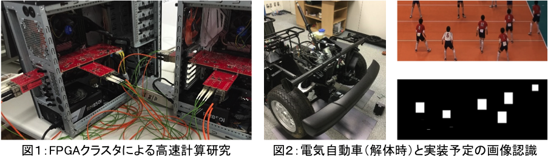

# FPGAチーム

## FPGA Team

**[チームのWebページ](https://www.lila.cs.tsukuba.ac.jp/)もチェック！**

</img>

## 研究内容

### 山口 佳樹 准教授

AI (Artificial Intelligence)，5G/IoT，BigData は，Webページやニュースなどでも，一般に利用される単語となりつつあります．これらを支える情報システムとして，膨大なデータを対象とした演算加速装置，5G/IoTを支える高速通信装置，集約されたデータを高速に取り扱うストレージ装置などがあります．では，これら全ての分野で，FPGAが注目を集めるデバイスとなっていることは知っているでしょうか？
演算加速という面では，Microsoft，IBM，Amazon，百度などがデータセンタ向けに FPGA を利用し始めています．具体的には，サーチエンジン，AI 学習，医療画像処理，遺伝子検索，流体シミュレーションなどに利用されつつあります．ネットワークという面では，GPUで有名な Nvidia が Mellanox (FPGAを利用したネットワークスイッチを製造・販売した企業）を2019年3月に買収，これに対抗して Intel が FPGA 部門とネットワーク部門の統合を2019年6月に発表しました．ストレージ装置という面では，DELL EMCや富士通などの大手メーカが FPGA の採用を決めています．このことから，FPGA は既存のITシステムを変え，ITサービスを変え，社会を変える，という人もいます．
FPGAチームは，約20年蓄積されたFPGA研究/実装/開発の経験に基づき，学術的研究に加え産業界もにらんだ実問題を対象とするハードウェア加速機構について真剣に議論します．具体的には，理化学研究所，産業技術総合研究所，高エネルギー加速器研究機構，物質材料研究機構などと共同研究を行っています．また，インターンシップや留学などの相談も可能です．興味を持った人は，研究室紹介で会いましょう．

FPGAアーキテクチャから，FPGAを用いたアプリケーションに関する研究までを縦断的に扱っています．既に始まっている半導体を中心とした情報システムの再編のキーワードはチップレットとFPGA．興味を持ったら，研究室紹介で聞いてみましょう．

</img>

### FPGA (Field Programmable Gate Array) チームについて

　FPGAは，自動運転，医療/福祉，ロボット，ビッグデータ，安全・安心，航空宇宙等の分野で数多くの企業が利活用しています．そしてそこでは，画像/音声検出，認識，追尾，圧縮処理，(ビッグデータ等)高速処理，大規模科学技術計算（宇宙・海洋・風洞），暗号処理などで更なる高性能計算が求められています．また，FPGAを本当の意味で活用するために，FPGAに加え，GPUやCPUの特徴についても研究室では学んでいきます．
　日本のFPGAに関する研究および技術は高く評価され，FPGA分野の一流の国際会議を日本に誘致できるほどになっています．興味を持った人はぜひ研究室紹介に参加しましょう．

<!--
他チームとの協力
----------------
-->

## メンバー

| 名前 | 職階 | 研究内容・メッセージ |
|:-----|:---|:-------------------------|
|[山口 佳樹](http://www.cs.tsukuba.ac.jp/~yoshiki/)|准教授|リコンフィギャラブルデバイス（FPGA，DAPDNA，DRP，など）とそれを用いたシステム． FPGAアーキテクチャから，FPGAを用いたアプリケーションに関する研究までを縦断的に扱っています．既に始まっている半導体を中心とした情報システムの再編のキーワードはチップレットとFPGA．興味を持ったら，研究室紹介で聞いてみましょう．|
|Firmansyah IMAN|Researcher|The research focuses on developing stereo matching processing using FPGA. Stereo matching is an algorithm targeted to reconstruct a distance or 3D position from two rectified images. The FPGA is employed in stereo matching to gain the real time processing.|
|Riadh Ben Abdelhamid |Ph.D|Design of High Performance Computing many-core overlay architecture. Optimization of FPGA design implementations. Researching novel techniques for efficient instruction-set-based computing, including design of instruction set architectures. Studying coarse-grained-reconfigurable-architectures (CGRA) for High performance computing applications such as numerical simulations or scientific computing.|
|原澤輝|M2||
|古川和輝|M2|筑波大学計算科学研究センターで開発が進む，宇宙輻射流体力学シミュレーションの演算加速の研究をしています．FPGAやGPU，メモリ，アプリケーションに関する様々な特性を深く理解し，最適解を探します．実装が動作すると大きな喜びを得られます．|
|伊藤瑞基|M2||
|小林駿也|M2|交通標識認識の研究をしています．色（HSV色空間）と形状による標識検出とテンプレートマッチングによる認識の2段階手法をとり，現在は小規模FPGAへの実装を行っています．|
|新開裕|M2|FPGAと複数の６軸センサを利用したリアルタイム慣性航法の研究を行っています．場所による制限を設けないよう，小型のFPGAによる実装を目標とし，複数センサを用いた複雑なフィルタを用いない補正方法を考えています．|
|庭瀬稜平|M2|FPGAによる大規模数値計算などへの応用に向けた高速ノード間インターコネクトの実装に関する研究に取り組んでいます．|
|中井榛希|M2|RDFデータベースを，広帯域なメモリ(HBM)を積んだFPGAアクセラレータカードを利用して高速化する研究をしています．現在は，HBMおよび周辺回路の帯域・遅延などの特性について調査しています．|
|康博文|M2|高解像度の映像が高速処理の研究をしています．FPGAに基づいて，高解像度の映像がSATAインターフェイスを介して，大容量の保存と高速転送を行っています．主に，自動車シミュレーター開発領域の進歩に役立つことを目標として頑張っています．|
|程詩茹|M2||
|張晨光|M2|ドローンの自動飛行を研究しています．リモコンとGPS測位がないと，ドローンは自動的に特定のマーカーを認識して飛行します．今は，ドローンの信号伝送部分を研究しています．|
|張曦|M2||
|宋雨純|M2|HBMが付けてFPGAを用いて，RDFデータベースのjoin処理を高速化するの研究をやっています．|
|徐棟宇|M2||
|高琦翔|M2|RISC-Vプロセッサの実装及び最適化について研究しております．RISC-Vというオープン標準と，再構成可能なFPGAの組み合わせで，回路規模や機能の拡張により，組み込みシステムからハイパフォーマンスシステムまで搭載できます．|
|小堀泰雅|M1|球面ディスプレイ上に表示される映像の低遅延歪み補正や，アイトラッカーにより視線位置を検出し段階的に解像度劣化させるシステムが人の認知時間にどう影響するかを研究しています．|
|中川諒|M1|農業用ドローンに搭載する，リコンフィギャラブルな画像処理システムについての研究をしています．ときにはオシロスコープも使い，電気信号レベルで動作を調べることもあります．|
|顾超渊|M1|私はFPGAに基づいて，高解像度の映像がSATAインターフェイスを介して，大容量の保存と高速転送を行っています． そして，この技術を自動車シミュレーション運転に適用して，明確なリアルタイム画像を取得することを検討しています．|
|陶毅寧|M1|身体（手・足・腰）に取り付けた加速度センサで取得したデータを利用して，実時間で動作（歩く，走る，階段の昇降，停止など）を実時間で分類する組込みシステムについて開発しています．現在，動作認識を AI で行っていますが，将来的には，通常の歩行と異常時の歩行などの違いを検出し，高齢者の転倒予防や傷病後のリハビリテーション効率の改善など，人に優しい IoT を実現したいと考えています．|
|郭氷潔|M1|RISC-V基準で構成しているプロセッサの移植性を研究しています．RISC-Vが発展している今，柔軟性を持っていたFPGA上で様々なシステムが作られています．それらのシステムは性能が優れる一方，限られていた環境だけ動いています．本研究は沢山のボードや開発環境でそれらのシステムを応用できるように開発を進んています．|
|馬文軒|M1|私はFPGAに基づいて，TOFカメラによる多画像のリアルタイムでの結合に関する研究を進めています．以後，研究の結果は車輌やドローンでの運用を検討しています．|
|瀬口知洋|M1|高速シリアルリンクを用いたFPGAクラスタシステムによる科学技術計算の高速化の研究を進めています．大規模な計算において，一枚のFPGAでは処理しきれない場合も多いため，複数のFPGAを搭載し，更にそのFPGA間でデータを通信する必要があります．本研究ではPCIe通信と光通信をシームレスに統合する機構を実装し，多数のFPGAを経由した通信のルーティングを行います．|
|楊樹|M1||
|黒沢竹雄|B4|自動運転を実現するプログラムの学習効率を高めるために，「自動車の横方向の位置や進行方向を変更したときのARパノラマ映像のリアルタイム生成」を目標に研究を行っています．具体的には，現在ビデオカメラの映像をFPGA上でリアルタイムで可逆圧縮し，SATAを用いてSSDに保存するための研究と実装に取り組んでおり，将来的には複数のカメラ間で同期をとりながら前述の処理を行ったり，パノラマ画像の材料となる複数の画像を短時間で読みだしてくる方法等について研究を深めていきたいと考えています．FPGAを用いて苦労して何かを完成させたとき，JavaやPython等ではあまり意識することのない「低レイヤ」の部分から関わったという達成感を味わうことができるのが醍醐味・・・だと思います（私もそれを味わうために頑張っています！）|
|大島慶之|B4||

## 研究室紹介スケジュール
事前の登録等は不要です．時間になりましたら，それぞれの開催日のリンクをクリックして，直接Teams上の説明会に参加してください．

| 日付 | 時間 | 場所 |
|:-----|:---|:-------------------------|
|10/1(金)|18:15~19:30|MS Teams，参加は[こちら](https://teams.microsoft.com/l/meetup-join/19%3aTHHl25XBhnaTtiZ3l4L4cJLvaZaEck232ccOFdC_Xlo1%40thread.tacv2/1631956499536?context=%7b%22Tid%22%3a%229e5b5dfd-669d-4ef8-b240-4229cbf4a83d%22%2c%22Oid%22%3a%228c3b2b11-fc5d-4f45-ab39-11e5e2abc40a%22%7d)をクリック（登録不要）|
|10/6(水)|16:45~18:00|MS Teams，参加は[こちら](https://teams.microsoft.com/l/meetup-join/19%3aTHHl25XBhnaTtiZ3l4L4cJLvaZaEck232ccOFdC_Xlo1%40thread.tacv2/1631956553506?context=%7b%22Tid%22%3a%229e5b5dfd-669d-4ef8-b240-4229cbf4a83d%22%2c%22Oid%22%3a%228c3b2b11-fc5d-4f45-ab39-11e5e2abc40a%22%7d)をクリック（登録不要）|
|10/7(木)|12:15~13:30|MS Teams，参加は[こちら](https://teams.microsoft.com/l/meetup-join/19%3aTHHl25XBhnaTtiZ3l4L4cJLvaZaEck232ccOFdC_Xlo1%40thread.tacv2/1631956595099?context=%7b%22Tid%22%3a%229e5b5dfd-669d-4ef8-b240-4229cbf4a83d%22%2c%22Oid%22%3a%228c3b2b11-fc5d-4f45-ab39-11e5e2abc40a%22%7d)をクリック（登録不要）|
<!--~~MS Teamsでの参加には次のURLよりアクセス登録が必要となります．~~-->
<!--~~https://teams.microsoft.com/l/team/19%3a4bcd7dd69b064015b9b3889aeaf13245%40thread.tacv2/conversations?groupId=6ab484fa-a60e-478d-894d-477cd6666044&tenantId=9e5b5dfd-669d-4ef8-b240-4229cbf4a83d~~ -->

<!--
近年の研究成果について
----------------------

一例として，今年 (2016年) に情報処理学会HPC研究会に投稿した研究会原稿 (日本語) を紹介します．
筑波大学は情報処理学会と機関契約をしていますので，筑波大学構内のネットワークからは自由にダウンロード可能です．
-->

## 近年の活動
### 受賞
- 2019年09月　　ESS2019で，長岡が，研究奨励賞を受賞しました
- 2019年03月　　第81回情報処理学会全国大会で，紀野国が，学生奨励賞を受賞しました
- 2019年03月　　第81回情報処理学会全国大会で，敖が，学生奨励賞を受賞しました
- 2017年09月　　RECONF研究会で，中村が，優秀講演賞を受賞しました
- 2016年09月　　FIT2017で，中野が，FITヤングリサーチャー賞を受賞しました．
- 2016年09月　　FIT2017で，高山が，FIT2016奨励賞を受賞しました．
- 2016年09月　　FIT2017で，中野が，FIT2016奨励賞を受賞しました．

<!--
### 報道 ###

・07/28　　バレーボールシステムの研究が日経産業新聞様の先端技術面で紹介されました．

### 出版 ###
・04/22　　[FPGAの原理と構成](http://shop.ohmsha.co.jp/shopdetail/000000004588/)が出版されました．山口先生が第7章の応用事例紹介を担当されました．      
　　　- "FPGAの原理と構成", 第7章 PLD/FPGAの応用事例, オーム社, p.209-245, 2016年4月．
-->
