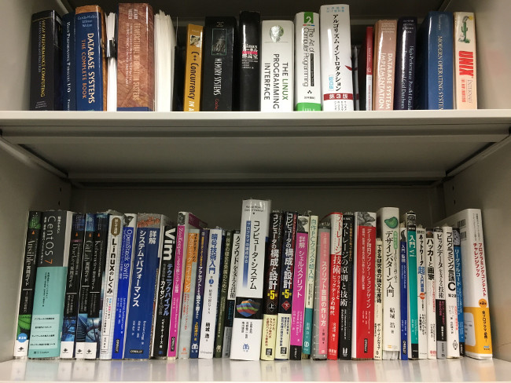

# システムソフトウェアチーム

</img>

## 研究トピック

### 建部 修見 教授

#### HPC・ビッグデータ・AIのための並列分散システムソフトウェア

HPC, ビッグデータ, AIのための並列分散システムソフトウェアの研究を行います．演算性能はGPU等の演算加速器により高速化が図られますが, ストレージ性能とのギャップが問題となっています．HPC, ビッグデータ, AIではこのギャップの解消が急務となっており、アーキテクチャ, ソフトウェアの両面から問題に取り組みます．HPC用大規模PCクラスタ, <a href="https://www.ccs.tsukuba.ac.jp/supercomputer/#Cygnus">Cygnus</a>，<a href="https://www.ccs.tsukuba.ac.jp/supercomputer/#OFP">Oakforest-PACS</a>等のスパコンを利用して研究を進めていきます．以下のビデオは以前の研究プロジェクトのハイライトです．

<iframe width="560" height="315" src="https://www.youtube.com/embed/XvcKs-c9nA8" frameborder="0" allow="autoplay; encrypted-media" allowfullscreen style="max-width: 100%"></iframe>

#### テーマの例

1. 分散ストレージシステム，バーストバッファ
演算性能とストレージ性能のギャップを埋めるため，その中間的なレイヤとしてバーストバッファの利用が注目されています．バーストバッファは，パーシステントメモリ，フラッシュデバイスなど高速なデバイスで構成されたキャッシュのようなシステムです．ただし，まだ発展途上の技術であり多くの技術課題があります．分散ストレージシステム，バーストバッファの設計，評価，高性能化を行います．本研究室では<a href=http://oss-tsukuba.org/software/gfarm>Gfarmファイルシステム</a>をベースとしたGfarm/BBバーストバッファシステムの研究開発を行うほか，新しい設計によるプロトタイピング，評価などを行っています．

1. Spark/MapReduce，並列I/Oなどのクライアントライブラリ
高速な分散ストレージ，バーストバッファを効率よく利用するためには，クライアントライブラリの設計が重要となります．パーシステントメモリ，フラッシュデバイスなどに適したライブラリの設計，拡張，高性能化を行います．本研究室では，スパコンで利用される並列I/OのライブラリMPI-IOにおいて，ノードローカルストレージを効率的に利用するための設計/実装，Sparkからオブジェクトストレージを効率よくアクセスするための設計/実装などを行っています．

1. 深層学習システムの性能評価，高性能化
TensorFlow, MXNet, PyTorch などの機械学習フレームワークにおいて，大規模なデータセットで学習を行うさい，データの読込みがボトルネックとなります．これにより，大規模なデータセットでの学習が困難なものとなっています．大規模なデータセットでの学習に対する機械学習フレームワークの性能評価，高性能化を行います．本研究室では，この読込性能のボトルネックを解消するため，バーストバッファを応用したキャッシュシステムの提案/実装を行っています．

## 研究室説明会日程
最終更新日: 2021-09-16

### 全体説明会

|日付|時間|場所|
|:---|:---|:---|
|2021/10/1 (金)|16:45 ~ 18:00|ZOOM|

### 研究室公開
|日付|時間|場所|
|:---|:---|:---|
|2021/10/6  (水)|18:15 ~ 19:00|総合研究棟B 1121 + オンライン|
|2021/10/15 (金)|18:15 ~ 19:00|総合研究棟B 1121 + オンライン|

 今年は物理開催とオンラインの両方で研究室説明会を行います.   
オンライン開催のリンクについては[説明会スケジュール](https://www.hpcs.cs.tsukuba.ac.jp/bachelor/#!schedule.md)ページのリンク先のGoogle Formからリモート参加の受付を行ってください.

## メンバー

<!-- |教員名|職階|研究分野に関するキーワード| -->

| 名前 | 職階 | 研究内容・メッセージ |
|:-----|:---|:-------------------------|
|[建部 修見](http://www.hpcs.cs.tsukuba.ac.jp/~tatebe/index-j.html)|教授|分散ファイルシステム, 並列システムソフトウェア システムソフトウェアに興味がある人, 大きいことをやってみたい人は是非どうぞ. 好きなことをやってください. |
| 平賀 弘平 | 研究員 | 分散メタデータサーバ、MPI-IO分散システムやシステムソフトウェアに興味のある方はぜひ一緒に研究しましょう。不揮発性メモリを使ってみたい方もどうぞ！ |
| 中谷 裕一 | D1 | |
| 倉本 健 | M2 | 大規模かつ高性能な計算機を利用できます。個人では難しい「大きいこと」をやってみたい方はぜひご検討ください。 |
| 巨畠 和樹 | M1 | 不揮発性メモリを使ったストレージシステムの研究を行ってます。研究室の潤沢な計算資源だけでなく、Cygnusなどのスーパーコンピューターを用いた研究も行えます。計算機好き、HPCに興味のあるかたは是非一緒に研究しましょう！|
| 笠井 大暉 | M1 | 分散ファイルシステムにおけるノードローカルSSDの利用について研究を進めています。|
| 木下 嵩裕 | B4 | 研究内容: ハードウェアの特性を汲んだ不揮発メモリの効率的な使い方 メッセージ: 潤沢な計算資源，環境があります．ぜひ一緒に研究しましょう．  |
| 小山 創平 | B4 | HPC向け通信ライブラリに興味があります。思いついたことをすぐ実験できるHPC環境が整っています。 |

## 研究論文

### 論文誌
1. Scalable Distributed Metadata Server Based on Nonblocking Transactions
    - Kohei Hiraga, Osamu Tatebe, Hideyuki Kawashima, 
    - Journal of Universal Computer Science, Vol.26, Issue 1, pp.89-106, 2020

1. Gfarm/BB - Gfarm file system for node-local burst buffer
    - Osamu Tatebe, Shukuko Moriwake, Yoshihiro Oyama, 
    - Journal of Computer Science and Technology, Vol.35, Issue 1, pp.61-71, doi: 10.1007/s11390-020-9803-z, 2020

1. Skew-Aware Collective Communication for MapReduce Shuffling
    - Harunobu Daikoku, Hideyuki Kawashima, and Osamu Tatebe, 
    - IEICE Transactions on Information and Systems, Vol.E102-D, No.12, pp.2389-2399, doi: 10.1587/transinf.2019PAP0019, 2019

1. Integration of TicToc Concurrency Control Protocol with Parallel Write Ahead Logging Protocol
    - Yasuhiro Nakamura, Hideyuki Kawashima, Osamu Tatebe,  
    - International Journal of Networking and Computing, Vol.9, No.2, pp.339-353, doi: 10.15803/ijnc.9.2_339, 2019

### 国際発表

1. [Skew-Aware Collective Communication for MapReduce Shuffling](https://search.ieice.org/bin/summary_advpub.php?id=2019PAP0019&category=D&lang=E&abst=)
    - Harunobu Daikoku, Hideyuki Kawashima, and Osamu Tatebe,
    - IEICE Transactions on Information and Systems, Vol.E102-D, No.12, Dec. 2019 (to appear)

1. [Integration of TicToc Concurrency Control Protocol with Parallel Write Ahead Logging Protocol](http://ijnc.org/index.php/ijnc/article/view/213)
    - Yasuhiro Nakamura, Hideyuki Kawashima, Osamu Tatebe
    - International Journal of Networking and Computing, Vol.9, No.2, pp.339-353, 2019

1. [Skew-Aware Collective Communication for MapReduce Shuffling](https://ieeexplore.ieee.org/document/8622088)
    - Harunobu Daikoku, Hideyuki Kawashima, Osamu Tatebe
    - Proceedings of the 6th Workshop on Scalable Cloud Data Management, pp.3331-3340, doi: 10.1109/BigData.2018.8622088, 2018 

1. [Integrating TicToc with Parallel Logging](https://ieeexplore.ieee.org/abstract/document/8590882)
    - Yasuhiro Nakamura, Hideyuki Kawashima, Osamu Tatebe
    - The Sixth International Symposium on Computing and Networking (CANDAR 2018)

1. [PPMDS: A Distributed Metadata Server based on Nonblocking Transactions](https://ieeexplore.ieee.org/abstract/document/8554478/)
    - Kohei Hiraga, Osamu Tatebe, Hideyuki Kawashima
    - Proceedings of the Second International Workshop on Data Science Engineering and its Applications, 2018

1. [Applying Pwrake Workflow System and Gfarm File System to Telescope Data Processing](https://ieeexplore.ieee.org/abstract/document/8514866)
    - Masahiro Tanaka, Osamu Tatebe, Hideyuki Kawashima
    - 2018 IEEE International Conference on Cluster Computing (CLUSTER), pp. 113-122, Sep. 2018.

1. [Integration of Parallel Write Ahead Logging and Cicada Concurrency Control Method](https://ieeexplore.ieee.org/abstract/document/8421375)
    - Takayuki Tanabe, Hideyuki Kawashima, Osamu Tatebe
    - 2nd IEEE International Workshop on Big Data and IoT Security in Smart Computing (BITS2018)

1. Design of Locality-aware MPI-IO for Scalable Shared File Write Performance
    - Kohei Sugihara, Osamu Tatebe 
    - Proceedings of the IEEE International Workshop on High-Performance Storage, pp.1080-1089, doi: 10.1109/IPDPSW50202.2020.00179, 2020

1. GHOSTZ PW/GF: Distributed Parallel Homology Search System for Large-scale Metagenomic Analysis
    - Kenta Machida, Osamu Tatebe, Kenta Machida, Osamu Tatebe 
    - Proceedings of the Third IEEE International Workshop on Benchmarking, Performance Tuning and Optimization for Big Data Applications (BPOD 2019), pp.3492-3700, doi: 10.1109/BigData47090.2019.9006499, 2019

1. Accelerating Machine Learning I/O by overlapping data staging and mini-batch generations
    - Kazuhiro Serizawa, Osamu Tatebe, 
    - Proceedings of the 6th IEEE/ACM International Conference on Big Data Computing, Applications and Technologies, pp.31-34, doi: 10.1145/3365109.3368768, 2019

1. In-situ data analysis system for high resolution meteorological large eddy simulation model
    - Takuto Sato, Osamu Tatebe, Hiroyuki Kusaka,  
    - Proceedings of the 6th IEEE/ACM International Conference on Big Data Computing, Applications and Technologies, pp.155-158, doi: 10.1145/3365109.3368769, 2019

### 国内発表
情報処理学会HPC研究会とOS研究会に投稿した研究会原稿に関して，筑波大学は情報処理学会と機関契約をしていますので，これらの原稿は筑波大学構内のネットワークからは自由にダウンロード可能です．

1. [分散オブジェクトストレージ Ceph のための Spark ストレージアダプタの設計](http://id.nii.ac.jp/1001/00199028/)
  - 高橋宗史, 建部修見
  - 情報処理学会 第171回 HPC 研究会報告

1. [ユーザ権限におけるDockerオーケストレーションの構築と撤去](http://id.nii.ac.jp/1001/00199031/)
  - 畑中智之, 建部修見
  - 情報処理学会 第171回 HPC 研究会報告

1. [大規模ゲノムデータに対する分散並列相同性検索システムの提案]( http://id.nii.ac.jp/1001/00198078/)
  - 町田健太, 建部修見
  - 情報処理学会 第170回 HPC 研究会報告 (SWoPP 2019)

1. [Gfarmとクラウドストレージによる階層型ストレージシステムの研究](http://id.nii.ac.jp/1001/00198072/)
  - 北澤昂大, 建部修見
  - 情報処理学会 第170回 HPC 研究会報告 (SWoPP 2019)

1. [大規模機械学習訓練におけるI/O性能の高速化](http://id.nii.ac.jp/1001/00198056/)
  - 芹沢和洋, 建部修見
  - 情報処理学会 第170回 HPC 研究会報告 (SWoPP 2019)

2017年以前は[こちら](https://www.hpcs.cs.tsukuba.ac.jp/publications/)より参照できます. 

## 日常生活

1. コロナウイルスの影響を受け, ミーティングがオンライン（Zoom）になりました. チームミーティングは週に一回, 全体ミーティングは二週間に一回程です. 
1. コアタイムはありません 
1. 研究室内には, 電子レンジ, 冷蔵庫, 電気ポット, コーヒーメーカー, ソファ等の備品もあり, 所属している学生は自由に使用することができます. ~~また，物販もあり，軽食・飲み物等が購入可能です．~~
1. 楽しいイベントがいくつかあります
