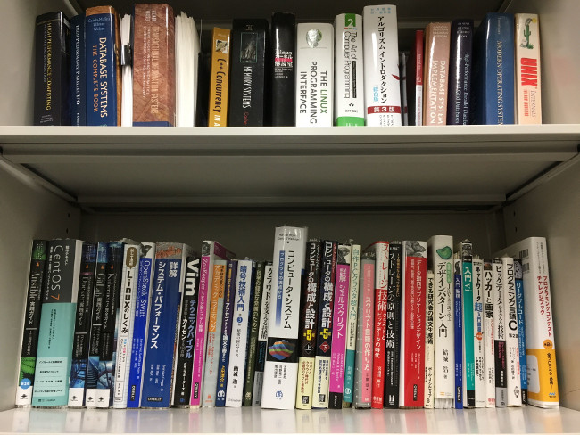

# システムソフトウェアチーム

</img>

## 研究トピック

### 建部 修見 教授

#### HPC・ビッグデータ・AIのための並列分散システムソフトウェア

HPC, ビッグデータ, AIのための並列分散システムソフトウェアの研究を行います．演算性能はGPU等の演算加速器により高速化が図られますが, ストレージ性能とのギャップが問題となっています．HPC, ビッグデータ, AIではこのギャップの解消が急務となっており、アーキテクチャ, ソフトウェアの両面から問題に取り組みます．HPC用大規模PCクラスタ, <a href="https://www.ccs.tsukuba.ac.jp/supercomputer/#Cygnus">Cygnus</a>等のスパコンを利用して研究を進めていきます．以下のビデオは以前の研究プロジェクトのハイライトです．

<iframe width="560" height="315" src="https://www.youtube.com/embed/XvcKs-c9nA8" frameborder="0" allow="autoplay; encrypted-media" allowfullscreen style="max-width: 100%"></iframe>

特にこの秋から筑波大には不揮発性メモリを大規模に導入したビッグメモリスーパコンピュータPegasus が導入されます。Pegasus の大容量メモリ、また大容量不揮発性メモリを用いて研究を進めていきます。テーマの例としては以下のようなものがありますが、相談して決めていきます

#### テーマの例

1. 並列分散ストレージシステム，キャッシングファイルシステム

1. 並列I/O, Python などのクライアントライブラリ

1. 深層学習システム、並列アプリケーションの性能評価、高性能化

## 研究室説明会日程
最終更新日: 2022-09-20

### 全体説明会

|日付|時間|場所|
|:---|:---|:---|
|2022/10/5 (水)|15:15 ~ 16:30|総合研究棟B 1001 + ZOOM|

### 研究室公開
|日付|時間|場所|
|:---|:---|:---|
|2022/10/7  (金)|18:15 ~ 19:00|総合研究棟B 1121 + オンライン|
|2022/10/12 (水)|18:15 ~ 19:00|総合研究棟B 1121 + オンライン|
|2022/10/17 (月)|18:15 ~ 19:00|総合研究棟B 1121 + オンライン|

 今年は物理開催とオンラインの両方で研究室説明会を行います.   
オンライン開催のリンクについては[説明会スケジュール](https://www.hpcs.cs.tsukuba.ac.jp/bachelor/#!schedule.md)ページのリンク先のGoogle Formからリモート参加の受付を行ってください.

## メンバー

<!-- |教員名|職階|研究分野に関するキーワード| -->

| 名前 | 職階 | 研究内容・メッセージ |
|:-----|:---|:-------------------------|
|[建部 修見](http://www.hpcs.cs.tsukuba.ac.jp/~tatebe/index-j.html)|教授|分散ファイルシステム, 並列システムソフトウェア システムソフトウェアに興味がある人, 大きいことをやってみたい人は是非どうぞ. 好きなことをやってください. |
| 平賀 弘平 | 研究員 | 分散メタデータサーバ、MPI-IO分散システムやシステムソフトウェアに興味のある方はぜひ一緒に研究しましょう。不揮発性メモリを使ってみたい方もどうぞ！ |
| 中谷 裕一 | D2 | |
| 巨畠 和樹 | M2 | 不揮発性メモリを使ったストレージシステムの研究を行ってます。研究室の潤沢な計算資源だけでなく、Cygnusなどのスーパーコンピューターを用いた研究も行えます。計算機好き、HPCに興味のあるかたは是非一緒に研究しましょう！|
| 笠井 大暉 | M2 | 分散ファイルシステムにおけるノードローカルSSDの利用について研究を進めています。|
| 木下 嵩裕 | M1 | 研究内容: ハードウェアの特性を汲んだ不揮発メモリの効率的な使い方 メッセージ: 潤沢な計算資源，環境があります．ぜひ一緒に研究しましょう．  |
| 小山 創平 | M1 | HPCクラスタにおける機械学習ワークロードの高速化などに取り組んでいます。 |
| 丸山 泰史 | B4 | 研究テーマを選ぶ自由を与えてくれる研究室です。やりたいことをやりましょう。|

## 研究論文

最新の論文は[建部先生の個人ページ](http://www.hpcs.cs.tsukuba.ac.jp/~tatebe/research/publication-j.html)をご参照ください。

### 論文誌
1. Scalable Distributed Metadata Server Based on Nonblocking Transactions
    - Kohei Hiraga, Osamu Tatebe, Hideyuki Kawashima, 
    - Journal of Universal Computer Science, Vol.26, Issue 1, pp.89-106, 2020

1. Gfarm/BB - Gfarm file system for node-local burst buffer
    - Osamu Tatebe, Shukuko Moriwake, Yoshihiro Oyama, 
    - Journal of Computer Science and Technology, Vol.35, Issue 1, pp.61-71, doi: 10.1007/s11390-020-9803-z, 2020

1. Skew-Aware Collective Communication for MapReduce Shuffling
    - Harunobu Daikoku, Hideyuki Kawashima, and Osamu Tatebe, 
    - IEICE Transactions on Information and Systems, Vol.E102-D, No.12, pp.2389-2399, doi: 10.1587/transinf.2019PAP0019, 2019

1. Integration of TicToc Concurrency Control Protocol with Parallel Write Ahead Logging Protocol
    - Yasuhiro Nakamura, Hideyuki Kawashima, Osamu Tatebe,  
    - International Journal of Networking and Computing, Vol.9, No.2, pp.339-353, doi: 10.15803/ijnc.9.2_339, 2019

### 国際発表

1. [Scalable Data Parallel Distributed Training for Graph Neural Networks](https://ieeexplore.ieee.org/document/9835176)
    - Sohei Koyama, Osamu Tatebe,
    - Proceedings of Workshop on AI for Datacenter Optimization (ADOPT'22), pp.699-707, 10.1109/IPDPSW55747.2022.00121, 2022

1. [Caching Support for CHFS Node-local Persistent Memory File System](https://ieeexplore.ieee.org/document/9835238)
    - Osamu Tatebe, Hiroki Ohtsuji,
    - Proceedings of 3rd Workshop on Extreme-Scale Storage and Analysis (ESSA 2022), pp.1103-1110, 10.1109/IPDPSW55747.2022.00182, 2022

1. [CHFS: Parallel Consistent Hashing File System for Node-local Persistent Memory](https://dl.acm.org/doi/10.1145/3492805.3492807)
    - Osamu Tatebe, Kazuki Obata, Kohei Hiraga, Hiroki Ohtsuji,
    - Proceedings of the ACM International Conference on High Performance Computing in Asia-Pacific Region (HPC Asia 2022), pp.115-124, 10.1145/3492805.3492807, 2022

1. [Design of Direct Read from Sparse Segments in MPI-IO](https://ieeexplore.ieee.org/document/9407823)
    - Kohei Sugihara, Osamu Tatebe, 
    - Proceedings of the 6th IEEE International Conference on Data Science and Systems (DSS), pp.1308-1315, 10.1109/HPCC-SmartCity-DSS50907.2020.00168, 2020

1. [An Analysis of Consistency Control Protocols for In-Memory Databases with CCBench](https://dl.acm.org/doi/10.14778/3424573.3424575)
    - Takayuki Tanabe, Takashi Hoshino, Hideyuki Kawashima, Osamu Tatebe,
    - Proceedings of the VLDB Endowment, Vol. 13, No. 13, pp. 3531-3544, doi: 10.14778/3424573.3424575, 2020

1. [Design of Locality-aware MPI-IO for Scalable Shared File Write Performance](https://ieeexplore.ieee.org/document/9150399)
    - Kohei Sugihara, Osamu Tatebe,
    - Proceedings of the IEEE International Workshop on High-Performance Storage, pp.1080-1089, doi: 10.1109/IPDPSW50202.2020.00179, 2020

1. [GHOSTZ PW/GF: Distributed Parallel Homology Search System for Large-scale Metagenomic Analysis](https://ieeexplore.ieee.org/abstract/document/9006499)
    - Kenta Machida, Osamu Tatebe,
    - Proceedings of the Third IEEE International Workshop on Benchmarking, Performance Tuning and Optimization for Big Data Applications (BPOD 2019), pp.3492-3700, doi: 10.1109/BigData47090.2019.9006499, 2019

1. [Accelerating Machine Learning I/O by overlapping data staging and mini-batch generations](https://dl.acm.org/doi/10.1145/3365109.3368768)
    - Kazuhiro Serizawa, Osamu Tatebe,
    - Proceedings of the 6th IEEE/ACM International Conference on Big Data Computing, Applications and Technologies, pp.31-34, doi: 10.1145/3365109.3368768, 2019

1. [In-situ data analysis system for high resolution meteorological large eddy simulation model](https://dl.acm.org/doi/10.1145/3365109.3368769)
    - Takuto Sato, Osamu Tatebe, Hiroyuki Kusaka,
    - Proceedings of the 6th IEEE/ACM International Conference on Big Data Computing, Applications and Technologies, pp.155-158, doi: 10.1145/3365109.3368769, 2019

1. [Skew-Aware Collective Communication for MapReduce Shuffling](https://search.ieice.org/bin/summary_advpub.php?id=2019PAP0019&category=D&lang=E&abst=)
    - Harunobu Daikoku, Hideyuki Kawashima, and Osamu Tatebe,
    - IEICE Transactions on Information and Systems, Vol.E102-D, No.12, Dec. 2019 (to appear)

1. [Integration of TicToc Concurrency Control Protocol with Parallel Write Ahead Logging Protocol](http://ijnc.org/index.php/ijnc/article/view/213)
    - Yasuhiro Nakamura, Hideyuki Kawashima, Osamu Tatebe
    - International Journal of Networking and Computing, Vol.9, No.2, pp.339-353, 2019

1. [Skew-Aware Collective Communication for MapReduce Shuffling](https://ieeexplore.ieee.org/document/8622088)
    - Harunobu Daikoku, Hideyuki Kawashima, Osamu Tatebe
    - Proceedings of the 6th Workshop on Scalable Cloud Data Management, pp.3331-3340, doi: 10.1109/BigData.2018.8622088, 2018 

1. [Integrating TicToc with Parallel Logging](https://ieeexplore.ieee.org/abstract/document/8590882)
    - Yasuhiro Nakamura, Hideyuki Kawashima, Osamu Tatebe
    - The Sixth International Symposium on Computing and Networking (CANDAR 2018)

1. [PPMDS: A Distributed Metadata Server based on Nonblocking Transactions](https://ieeexplore.ieee.org/abstract/document/8554478/)
    - Kohei Hiraga, Osamu Tatebe, Hideyuki Kawashima
    - Proceedings of the Second International Workshop on Data Science Engineering and its Applications, 2018

1. [Applying Pwrake Workflow System and Gfarm File System to Telescope Data Processing](https://ieeexplore.ieee.org/abstract/document/8514866)
    - Masahiro Tanaka, Osamu Tatebe, Hideyuki Kawashima
    - 2018 IEEE International Conference on Cluster Computing (CLUSTER), pp. 113-122, Sep. 2018.

1. [Integration of Parallel Write Ahead Logging and Cicada Concurrency Control Method](https://ieeexplore.ieee.org/abstract/document/8421375)
    - Takayuki Tanabe, Hideyuki Kawashima, Osamu Tatebe
    - 2nd IEEE International Workshop on Big Data and IoT Security in Smart Computing (BITS2018)

1. Design of Locality-aware MPI-IO for Scalable Shared File Write Performance
    - Kohei Sugihara, Osamu Tatebe 
    - Proceedings of the IEEE International Workshop on High-Performance Storage, pp.1080-1089, doi: 10.1109/IPDPSW50202.2020.00179, 2020

1. GHOSTZ PW/GF: Distributed Parallel Homology Search System for Large-scale Metagenomic Analysis
    - Kenta Machida, Osamu Tatebe, Kenta Machida, Osamu Tatebe 
    - Proceedings of the Third IEEE International Workshop on Benchmarking, Performance Tuning and Optimization for Big Data Applications (BPOD 2019), pp.3492-3700, doi: 10.1109/BigData47090.2019.9006499, 2019

1. Accelerating Machine Learning I/O by overlapping data staging and mini-batch generations
    - Kazuhiro Serizawa, Osamu Tatebe, 
    - Proceedings of the 6th IEEE/ACM International Conference on Big Data Computing, Applications and Technologies, pp.31-34, doi: 10.1145/3365109.3368768, 2019

1. In-situ data analysis system for high resolution meteorological large eddy simulation model
    - Takuto Sato, Osamu Tatebe, Hiroyuki Kusaka,  
    - Proceedings of the 6th IEEE/ACM International Conference on Big Data Computing, Applications and Technologies, pp.155-158, doi: 10.1145/3365109.3368769, 2019

### 国内発表
情報処理学会HPC研究会とOS研究会に投稿した研究会原稿に関して，筑波大学は情報処理学会と機関契約をしていますので，これらの原稿は筑波大学構内のネットワークからは自由にダウンロード可能です．

1. [分散オブジェクトストレージ Ceph のための Spark ストレージアダプタの設計](http://id.nii.ac.jp/1001/00199028/)
  - 高橋宗史, 建部修見
  - 情報処理学会 第171回 HPC 研究会報告

1. [ユーザ権限におけるDockerオーケストレーションの構築と撤去](http://id.nii.ac.jp/1001/00199031/)
  - 畑中智之, 建部修見
  - 情報処理学会 第171回 HPC 研究会報告

1. [大規模ゲノムデータに対する分散並列相同性検索システムの提案]( http://id.nii.ac.jp/1001/00198078/)
  - 町田健太, 建部修見
  - 情報処理学会 第170回 HPC 研究会報告 (SWoPP 2019)

1. [Gfarmとクラウドストレージによる階層型ストレージシステムの研究](http://id.nii.ac.jp/1001/00198072/)
  - 北澤昂大, 建部修見
  - 情報処理学会 第170回 HPC 研究会報告 (SWoPP 2019)

1. [大規模機械学習訓練におけるI/O性能の高速化](http://id.nii.ac.jp/1001/00198056/)
  - 芹沢和洋, 建部修見
  - 情報処理学会 第170回 HPC 研究会報告 (SWoPP 2019)

2017年以前は[こちら](https://www.hpcs.cs.tsukuba.ac.jp/publications/)より参照できます. 

## 日常生活

1. コロナウイルスの影響を受け, ミーティングがオンライン（Zoom）になりました. チームミーティングは週に一回, 全体ミーティングは二週間に一回程です. 
1. コアタイムはありません 
1. 研究室内には, 電子レンジ, 冷蔵庫, 電気ポット, コーヒーメーカー, ソファ等の備品もあり, 所属している学生は自由に使用することができます. ~~また，物販もあり，軽食・飲み物等が購入可能です．~~
1. 楽しいイベントがいくつかあります
