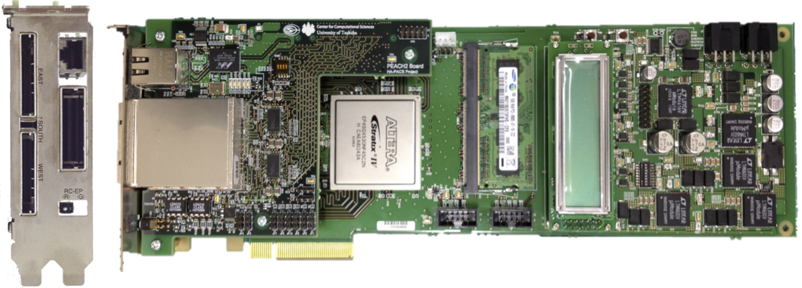

アーキテクチャチーム
==================

アーキテクチャチーム
------------
</img>

研究内容
--------

アーキテクチャチームでは，GPUやメニーコアプロセッサ等の演算加速装置をより有効に大規模並列処理に活用する手法や，超高性能並列処理向けネットワーク，さらにこれらを活用する高性能並列コンパイラの研究をしています．
現在の主な研究テーマは以下の通りです．なお，朴及び小林両教員が共同で適宜指導を行いますが，研究室配属時点では主なテーマに応じてどちらかの教員を指導教員として選択して下さい．募集人数は朴教授が**2**名，小林助教が**1**名です．

+ FPGAを用いた演算オフローディングと高速通信の融合に関する研究
+ 大規模メニーコアシステムを用いた超並列アプリケーションの実装と最適化に関する研究（朴）
+ FPGAを用いた高速ソーティング回路に関する研究
+ GPUクラスタに向けた並列プログラミング言語に関する研究
+ 次世代スーパーコンピュータの性能予測シミュレータに関する研究

以下に，所属している学生達が行っている研究テーマについて紹介します．

### 高性能なFPGAアクセラレータとその開発方式に関する研究

    キーワード: FPGA, OpenCL, FPGAと高性能計算

近年，再構成可能ハードウェアとしてFPGAが注目され，多くの分野で使われるようになってきました．高性能計算においてもその流れがあり，我々は現在利用されているGPUやCPUがどうしても解決できない問題について，FPGAを用いることで高性能化・高速化が行えないか検討しています．また，CPU, GPUに加え，FPGAにおいてもOpenCLプラットフォーム (右図) がサポートされ，FPGAを用いたプログラミングが従来よりも格段に容易になったこともその流れを後押ししています．
このOpenCLの記述能力をフルに活用して，プログラミングコストを削減しつつ高性能なFPGAアクセラレータを実現することを目指しています．その一環として，初期宇宙の研究に重要な輻射輸送を解くプログラムで用いられているアルゴリズムをOpenCLで記述してFPGA向けに最適化する研究を本学の計算科学研究センターに所属する宇宙物理の研究者と共同で実施しています．

<!--
我々が提唱しているAiS (Accelerator in Switch) というコンセプトでは，再構成可能なFPGAを部分的計算を行う演算加速装置と高速通信との融合環境として捉え，次世代の効率的な並列処理を行う基盤技術開発を行っています．
これについてはFPGAチームとも連携を取りつつ，計算科学研究センターにおける次世代スーパーコンピュータの原型として開発を進めています．
-->

### GPU等の演算加速装置を含む並列処理アーキテクチャ及びネットワークに関する研究と，これらのシステムを効率的に利用するための並列プログラミング言語及びコンパイラに関する研究

    キーワード: GPGPU, FPGA, 大規模並列システムとネットワーク

Graphics Processing Unit (GPU) は，演算加速装置として高く注目されており，NVIDIA社のCUDAやKhronos GroupのOpenCLなどが実行プラットフォームとしてあります．
中でも，特にNVIDIA社のCUDAは高性能計算において広く利用され，筑波大学にもGPUを用いた大規模クラスタとして[HA-PACS/TCA](https://www.ccs.tsukuba.ac.jp/research/research_promotion/project/ha-pacs)が平成29年3月まで稼働していました．

しかしながらGPUはその特性上，GPU単体で通信を行うことができず，CPUによる操作が必要となります．
そのため，我々はTightly Coupled Accelerators (TCA) というコンセプトの元，FPGAでGPU間直接通信機構PEACH2を開発し，性能評価を行っています．
また，ソフトウェア側のアプローチとして，GPUプログラミングを簡単化するためにGPU間セルフ通信機構を提案しています．
GPUはその特性上，CPUによる操作が必要なることは既に述べましたが，これはプログラミングが複雑化することと同義です．
そこで我々は並列プログラミングを簡単にするため，並列プログラミング言語に関する研究も行っています．

### 超並列アプリケーションの性能向上に関する研究

    キーワード: Xeon Phi, GPGPU, メニーコア, 大規模並列システムとアプリケーション

2016年12月，筑波大学と東京大学は2016年6月現在で日本最速のスーパーコンピュータ「京」の2.5倍の性能を持つ[大規模メニーコアシステム「Oakforest-PACS」](http://jcahpc.jp/)を導入しました．
2018年6月の時点で，[国内上位3位内に位置する性能を持っています](https://www.top500.org/lists/2018/06/)．
メニーコアシステムは，これまでアクセラレータとして利用されていたIntel Xeon Phiの最新アーキテクチャ「Knights Landing」が用いられ，日本のフラッグシップマシンとして注目されています．
しかしながら，メニーコアシステムはその特性上従来のアプリケーションを高い効率で実行することが難しく，プログラムの修正・改良が必須となっています．
我々は，筑波大学計算科学研究センターの実応用分野の研究者と共同研究を行いOakforest-PACSや次世代並列計算機に向けたアプリケーションの実装・最適化を行っています．

また，連携大学院の佐藤三久教授との共同研究の下，理化学研究所で進められている次世代超並列計算機（ポスト「京」）プロジェクトの一部としての共同研究も行い，ネットワークシミュレーション，独自開発の並列処理言語・コンパイラ等の研究を進めています

世界的な活動
----------------
朴教授は国際会議でプログラム委員長を務めるなど、世界的に活躍しています。
<iframe width="560" height="315" src="https://www.youtube.com/embed/BDPsa7AP7NA" frameborder="0" allowfullscreen></iframe>

他チームとの協力
----------------

並列プログラミング言語に関する研究は[PAチーム](pateam.md)との共同研究で，我々のPEACH2をPAチームで開発している並列言語XcalableMPの演算加速装置向け拡張XcalableACCに導入した実績もあります．
また，[FPGAチーム](fpgateam.md)とも協力しFPGAの基礎評価や並列アプリケーションの実装などを行っています．

メンバー
----------------

|名前|職階|研究内容・メッセージ|
|:---|:---|:-------------------------|
|[朴 泰祐](http://www.hpcs.cs.tsukuba.ac.jp/~taisuke/)|教授|アクセラレータ, ネットワーク 大規模科学技術計算（計算科学）は，最先端のサイエンスを支える重要な研究であり，我々は本学の[計算科学研究センター](http://www.ccs.tsukuba.ac.jp/)を始めとする国内外の研究者との共同研究によってこれを実施しています．GPU，FPGA等の計算リソースは今後の同分野の研究推進に重要な要素であり，これらを積極的に用いた大規模計算科学の実質的な成果を目指した研究を日夜進めています．ぜひみなさんの若い力を貸して下さい！|
|[小林 諒平](https://sites.google.com/site/ryokbya/)|助教|GPU, FPGA, アクセラレータ, 高性能インターコネクト FPGAを使って自分だけの高性能ハードウェアを作ってみたい，高性能ハードウェアを簡単に作れる素敵なツールを実装してみたい，FPGAだけじゃなく，CPU, GPUを含めたヘテロジニアスコンピューティングについて探求したいという人は間違いなく当研究室に向いているので，どうぞ見学においで下さい．当研究室は，世界の第一線で活躍されている先生方を多く抱え，かつ学外の一流の研究者とも連携することができ，研究をするにおいてこれ以上無いくらい理想的な環境が用意されています．是非一緒に世界を獲る研究を行っていきましょう！[(詳細)](kobayashi.pdf) [(TSUKUBA FUTUREの記事)](http://www.tsukuba.ac.jp/notes/091/index.html)|
|藤田 典久|研究員|GPU, FPGA, アクセラレータ 大規模な科学技術計算にFPGAを適用する研究をしています。FPGA向けのアプリケーション最適化に関する研究だけでなく、FPGAが持つ高速な外部通信機構を用いて複数のFPGA間で通信し、大規模な問題を複数のFPGAで並列に計算をする研究も行っています。現在のFPGAは開発コストが高く、なかなか一筋縄にはいきませんが、CPUや他のアクセラレータでは実現できない処理がFPGAでは可能であり、将来性のあるデバイスであると考えています。そして何よりも、研究成果が出たときの達成感と喜びは格別です。最近ではフランクフルトで開催された国際会議で[HPC in ASIA poster award](https://www.ccs.tsukuba.ac.jp/award20180627/)を受賞しました。これ以外にも本研究室の研究内容は世界的に評価されているので，「**何か凄いことをして世界中の注目を集めてみたい！**」とこっそり思っている人にとって本研究室はまさに理想的な環境です。1ミリでも興味を持ったら是非遊びに来て下さい！|
|辻 大亮|M2|GPUを用いた気象アプリケーションの高速化 
NVIDIA社のGPUを演算加速装置として用いて，HPCプログラムの高速化を行っています．こちらの研究室ではHPC向けGPUであるP100やV100をいつでも使うことができます．HPCに興味のある方や，強いGPUを使ってみたい方はぜひ一度研究室見学にお越しください．
|
|綱島 隆太|M2|FPGA, GPU, アクセラレータ, OpenACC M1からの所属で、この秋学期から本格的な研究を始めます。この研究室では、TCAコンセプトを発展させたAiSという新しいコンセプトのアーキテクチャを実現すべく、研究しています。私はそのうち、従来の計算主体であるGPUが苦手な処理をFPGAで行えるようにするために、GPUメモリ上の計算データをFPGAから操作する技術について研究を行っています。これはAiSコンセプトの核の部分です。また、この技術を使うには、現状CPU、GPU、FPGAそれぞれの処理を別の言語で書かなければならない問題がありますが、これをすべて一つの言語で書けるようにするために、OpenACCというOpenMPのようなディレクティブ言語で行えるようにすることも検討しています。OpenACCコンパイラの一つ、OpenARCで複数のアクセラレータを組み合わせた処理を記述できるよう現在進行形で協議中です。ここまでの話は全て一人でやっているわけではなく、研究室内外の人と協力して行っています。|
|中道 安祐未|M2|FPGA,GPU GPU-FPGA関連系に関する研究を行っています。HPCに興味のある方は、ぜひ研究室にお越しください。|
|阿部 昂之|M1|GPU-FPGA協調計算 高性能計算についての研究を行うための環境が整っている研究室です。HPCS研究室は複数のチームから構成されているため、いろいろな人と交流をすることもできます。|
|柏野 隆太|B4|GPU-FPGA協調計算 今年の春からArchitectureチームに配属されました．HPCS研究室Architectureチームでは，PPXと呼ばれる共有マシンを自由に使用することができます．PPXには100万円を超えるFPGAやGPUが数多く搭載されており，これらのデバイスを気軽に使用することができます．また，HPCS研究室には数多くの先生方がおり，国際的にも大変活躍されています．そんな先生方からアドバイスがもらえる研究室です． HPCに興味のある方・高価なデバイスを使い倒してみたい方は，ぜひ研究室にお越しください．|
|渡邉孔英|B4|FPGA 今年の春からArchitectureチームに配属されました。現在は並列プログラミングについて学び、研究へ向けて準備を進めています。人もモノも揃っていて、研究に打ち込める環境が整っています。気になる方は、ぜひお越しください。|
|西野裕貴|B4|  今年の春からArchitectureチームに配属されました．|
近年の研究成果
----------------------
1. Performance Optimization and Evaluation of Scalable Optoelectronics Application on Large Scale KNL Cluster
    - Yuta Hirokawa, Taisuke Boku, Mitsuharu Uemoto, Shunsuke A. Sato, Kazuhiro Yabana
    - Proc. of [ISC High Performance 2018](https://www.isc-hpc.com/research-papers-2018.html), Frankfurt, Jun. 2018.
    - [https://link.springer.com/chapter/10.1007%2F978-3-319-92040-5_11](https://link.springer.com/chapter/10.1007%2F978-3-319-92040-5_11)
2. Accelerating HPC applications on FPGAs using OpenCL and FPGA Network
    - Norihisa Fujita, Ryohei Kobayashi, Yoshiki Yamaguchi, Makito Abe, Kohji Yoshikawa, Masayuki Umemura
    - HPC-in-Asia Invited Poster Session in ISC-HPC 2018 (best invited poster award)
    - [https://2018.isc-program.com/?page_id=10&id=apost109&sess=sess148](https://2018.isc-program.com/?page_id=10&id=apost109&sess=sess148)
3. Accelerating Space Radiate Transfer on FPGA using OpenCL
    - Norihisa Fujita, Ryohei Kobayashi, Yoshiki Yamaguchi, Yuuma Oobata, Taisuke Boku, Makito Abe, Kohji Yoshikawa, and Masayuki Umemura
    - Proc. of [HEART 2018](http://heart2018.eecg.toronto.edu/), Toronto, Jun. 2018. (nominated to best paper award)
4. OpenCL-ready High Speed FPGA Network for Reconfigurable High Performance Computing
    - Ryohei Kobayashi, Yuma Oobata, Norihisa Fujita, Yoshiki Yamaguchi, and Taisuke Boku
    - Proc. of [HPC Asia 2018](http://sighpc.ipsj.or.jp/HPCAsia2018/), Tokyo, Jan. 2018.
    - https://dl.acm.org/citation.cfm?id=3149479
5. Implementation and Evaluation of NAS Parallel CG Benchmark on GPU Cluster with Proprietary Interconnect TCA
    - Kazuya Matsumoto, Norihisa Fujita, Toshihiro Hanawa, and Taisuke Boku.
    - Proc. of [VECPAR2016](http://vecpar.fe.up.pt/2016/), Porto, Jul. 2016.
    - 上のVECPARのリンク先の写真で、朴先生はどこでしょう？見つかるかな？ (朴先生をさがせ!)
    - [https://link.springer.com/chapter/10.1007/978-3-319-61982-8_14](https://link.springer.com/chapter/10.1007/978-3-319-61982-8_14)
6. Electron Dynamics Simulation with Time-Dependent Density Functional Theory on Large Scale Symmetric Mode Xeon Phi Cluster 
    - Yuta Hirokawa, Taisuke Boku, Shunsuke Sato, and Kazuhiro Yabana.
    - Proc. of [PDSEC2016 (in IPDPS2016)](http://cse.stfx.ca/~pdsec16/), Chicago, 2016.
    - https://ieeexplore.ieee.org/document/7530004
7. 電子動力学シミュレーションのステンシル計算に対するメニーコアプロセッサ向け最適化
    - 廣川 祐太，朴 泰祐，佐藤 駿丞，矢花 一浩
    - 情報処理学会論文誌コンピューティングシステム (ACS), Vol. 9, No. 4, pp. 1-14, 2016.
    - http://id.nii.ac.jp/1001/00175938/
8. 密結合並列演算加速機構TCAによるGPU対応GASNetの実装と評価
    - 佐藤 賢太，藤田 典久，塙 敏博，松本 和也，朴 泰祐，Khaled Ibrahim
    - 情報処理学会HPCS2016 （最優秀論文賞受賞）.
    - http://id.nii.ac.jp/1001/00163660/
9. OpenCLを用いたFPGAによる宇宙輻射輸送シミュレーションの演算加速
    - 藤田 典久, 小林 諒平, 山口 佳樹, 大畠 佑真, 朴 泰祐, 他
    - 第161回IPSJ HPC研究会
    - http://id.nii.ac.jp/1001/00183479/
10. OpenCLとVerilog HDLの混合記述によるFPGA間Ethernet接続
    - 大畠 佑真, 小林 諒平, 藤田 典久, 山口 佳樹, 朴 泰祐 
    - 第160回IPSJ HPC研究会
    - http://id.nii.ac.jp/1001/00182678/
11. 電子動力学シミュレーションARTEDのKNLシステムOakforest-PACSでの全系性能評価
    - 廣川 祐太, 朴 泰祐, 植本 光治, 佐藤 駿丞, 矢花 一浩
    - 第160回IPSJ HPC研究会
    - http://id.nii.ac.jp/1001/00182693/
12. A proposal of GMPI: GPU self MPI for GPU clusters
    - Yuta Kuwahara, Toshihiro Hanawa, Taisuke Boku
    - [ACSI2016](http://acsi.hpcc.jp/2016/), Jan. 2016. (Outstanding Research Award)

