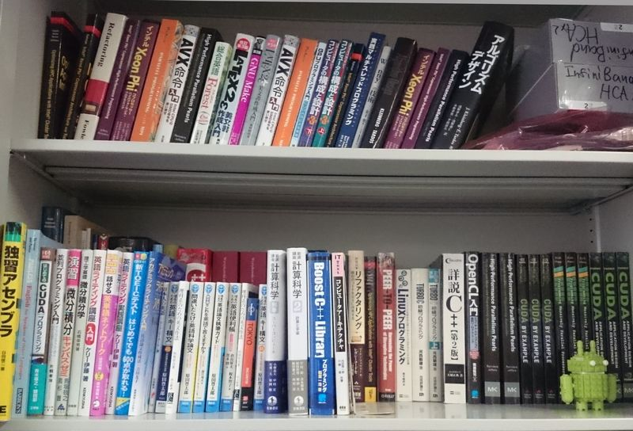

アルゴリズムチーム
==================

研究内容
--------

### 高橋 大介 教授 ###

　アルゴリズムチーム高橋の下では、限られた時間の中で大規模な科学技術計算を行うために、スーパーコンピュータの性能をできるだけ発揮できるようなアルゴリズムやプログラミングに関する研究を行っています。卒業研究では、

    1. 高性能並列数値計算ソフトウェア
    2. GPUやメニーコアプロセッサなどを用いた高性能計算
    3. 高精度計算アルゴリズムとその応用

などのテーマに取り組みます。もちろん、上記以外のテーマに取り組んで頂くことも可能です。
　高速なプログラムを作成するには、コンピュータの仕組みや数学について深い理解が必要になりますが、努力が性能という数字にそのまま反映されることから、やりがいがある分野です。

### 多田野 寛人 助教 ###

　アルゴリズムチーム多田野の下では，数値線形代数に関するアルゴリズム開発を行っています．卒業研究では,

    1. 大規模連立一次方程式の高速・高精度・高信頼性アルゴリズムの構築
    2. 連立一次方程式の求解高速化のための前処理法の開発
    3. 上記開発手法の実問題への応用、及び並列化による高性能化

などのテーマに取り組みます。これ以外のテーマに取り組むことも可能です。
　配属された学生さんには専用のPCが割り当てられ、MATLABやFortranなどでプログラムを組んで研究を行っていきます。数学やプログラミングが苦手でもしっかり指導しますので、心配はいりません。少しでも興味がありましたら、ぜひ説明会に来てみてください。

### アルゴリズムチームの使っている計算機について ###

　チームで所有している計算機としては、IntelのXeonプロセッサを搭載した4ノードのクラスタ2つのほか、IntelのXeon Phiプロセッサを搭載した4ノードのクラスタがあります。これらは学生によって管理・運用されていて自由に使うことができます。また本研究室は[計算科学研究センター](https://www.ccs.tsukuba.ac.jp/)と協力関係にあり、研究内容によっては筑波大学が運用するスーパーコンピュータ[Cygnus](https://www.ccs.tsukuba.ac.jp/supercomputer/#Cygnus) (理論ピーク性能2.4PFLOPS)，[Pegasus](https://www.ccs.tsukuba.ac.jp/supercomputer/#Pegasus) (理論ピーク性能6.5PFLOPS)を利用できます。これらの様々な計算機資源を利用して研究を行うことが可能です。

### FFT (高速フーリエ変換)
高橋教授の研究内容のひとつであるFFTをご紹介します。
<iframe width="560" height="315" src="https://www.youtube.com/embed/GPJx5JTGQEU" frameborder="0" allowfullscreen></iframe>

メンバー
----------------

| 名前 | 職階 | 研究内容・メッセージ |
|:-----|:---|:-------------------------|
|[高橋 大介](https://www.hpcs.cs.tsukuba.ac.jp/~daisuke/)|教授|数値計算, メニーコア, アクセラレータ 限られた時間の中で大規模なシミュレーションを行うために、スーパーコンピュータの性能をできるだけ発揮できるようなアルゴリズムやプログラミングに関する研究を行っています。高速なプログラムを作成するには、コンピュータの仕組みや数学について深い理解が必要になりますが、努力が性能という数字にそのまま反映されることから、やりがいがある分野です。|
|[多田野 寛人](https://www.hpcs.cs.tsukuba.ac.jp/~tadano/)|助教|線形方程式, 数値計算 当グループでは，数値線形代数に関するアルゴリズム開発を行っています．数値線形代数という研究分野は聞き慣れない方も多いと思いますが，　コンピュータを用いて大規模な連立一次方程式などを解く，といったことを行っています．そんなことをやって一体何の役に立つのか？と感じる方もいると思いますが，コンピュータで様々な現象のシミュレーションを行う際には多くの場面で大規模な連立一次方程式などが現れることから，必要不可欠な基盤技術となっています．みなさんもいろんな分野で役に立つアルゴリズムを研究してみませんか？|
|山口 博將|M2|ルジャンドル予想の数値的検証|
|長橋 朋也|M1|スライドパズルにおけるゼロ認識パターンデータベースの並列構築|
|落道 智也|M1|Intel Advanced Matrix Extensions（AMX）を用いた行列乗算|
|川上 昌汰|B4|8倍精度浮動小数点数を用いたFFTの実装|
|田中 雅俊|B4|複数右辺連立一次方程式に対する反復法の近似解精度改善|

近年の研究成果について
----------------------
研究成果については，以下のページよりご覧ください．

- 高橋 教授 : https://www.hpcs.cs.tsukuba.ac.jp/~daisuke/pub-j.html
- 多田野 助教 : https://www.hpcs.cs.tsukuba.ac.jp/~tadano/publication.html

一例として，2023年までに国際学会，情報処理学会HPC研究会等に投稿した研究会原稿を紹介します．
筑波大学は情報処理学会と機関契約をしていますので，筑波大学構内のネットワークからは自由にダウンロード可能です．

1. 漸化式の可変的グループ化によるBlock GWBiCGSTAB法の性能改善
    - 齋藤 颯人, 多田野 寛人
    - 【非線形問題の高性能解法と可視化技術に関する研究会】2022年度第1回研究会
1. 複数右辺連立一次方程式に対するブロック・グローバル混合型反復法の構築と性能評価
    - 菅沼 夏樹, 多田野 寛人
    - 日本応用数理学会2022年度年会
1. Application and performance evaluation of a method using block structures for saddle point problems appearing in image reconstruction problems
    - 石川 翔大, 多田野 寛人, 齋藤 歩
    - JSIAM Letters, Vol. 14, pp. 115-118 (2022)
    - https://doi.org/10.14495/jsiaml.14.115
1. 画像再構成問題に現れる鞍点型連立一次方程式に対するブロック構造を利用した前処理の適用とその性能評価
    - 石川 翔大, 多田野 寛人, 齋藤 歩
    - 日本応用数理学会 2021年度年会
1. 3次元モデル再構成問題に現れる鞍点型連立一次方程式の求解高速化
    - 石川 翔大, 多田野 寛人, 齋藤 歩
    - 【非線形問題の解法と可視化に関する研究会】2020年度第1回研究会
1. 3次元モデル再構成問題に現れる鞍点型連立一次方程式に対する前処理付き反復法の性能評価
    - 石川 翔大, 多田野 寛人, 齋藤 歩
    - 日本応用数理学会　第17回研究部会連合発表会
1. 複数右辺ベクトルを持つ線形方程式に対するブロック積型反復解法の近似解高精度化
    - 倉本 亮世，多田野 寛人
    - 日本応用数理学会論文誌. Vol. 30, No. 4, pp. 290-319 (2020)
    - https://doi.org/10.11540/jsiamt.30.4_290
1. 3次元モデル再構成問題に現れる鞍点型連立一次方程式に対する前処理付き反復法の開発
    - 石川 翔大, 多田野 寛人, 齋藤 歩
    - 日本応用数理学会「行列・固有値問題の解法とその応用」研究部会　第30回研究会
1. ルジャンドル予想の数値的検証
    - 山口博將，高橋大介
    - 情報処理学会第85回全国大会講演論文集，5J-05 (2023)
1. Efficient Large Integer Multiplication with Arm SVE Instructions
    - 枝松 拓弥, 高橋 大介
    - Proc. International Conference on High Performance Computing in Asia-Pacific Region (HPC Asia 2023)
    - https://doi.org/10.1145/3578178.3578193
1. Fast Multiple-Precision Integer Division Using Intel AVX-512
    - 枝松 拓弥, 高橋 大介
    - IEEE Transactions on Emerging Topics in Computing, Vol. 11, No. 1, pp. 224-236 (2023)
    - https://doi.org/10.1109/TETC.2022.3196147
1. A Fast Algorithm for Computing the Number of Magic Series
    - 杉﨑 行優, 高橋 大介
    - Annals of Combinatorics, Vol. 26, No. 2, pp. 511-532 (2022)
    - https://doi.org/10.1007/s00026-022-00584-5
1. A Rapid Euclidean Norm Calculation Algorithm that Reduces Overflow and Underflow
    - 原山 赳幸, 工藤 周平, 椋木 大地, 今村 俊幸, 高橋 大介
    - Proc. 21st International Conference on Computational Science and Its Applications (ICCSA 2021)
    - https://doi.org/10.1007/978-3-030-86653-2_7
1. オーバー・アンダーフローを抑えた高精度かつ高速な2ノルム計算手法
    - 原山 赳幸, 工藤 周平, 椋木 大地, 今村 俊幸, 高橋 大介
    - 第177回HPC研究発表会
    - http://id.nii.ac.jp/1001/00208770/
1. Fast Computation of the Exact Number of Magic Series with an Improved Montgomery Multiplication Algorithm
    - 杉崎 行優, 高橋 大介
    - Proc. 20th International Conference on Algorithms and Architectures for Parallel Processing (ICA3PP 2020)
    - https://doi.org/10.1007/978-3-030-60239-0_25
1. NVIDIA Volta GPUにおける浮動小数点演算を用いた剰余乗算の高速化
    - 杉崎 行優, 高橋 大介
    - [日本応用数理学会2020年度年会](https://annual2020.jsiam.org/)
1. Accelerating Large Integer Multiplication Using Intel AVX-512IFMA
    - 枝松 拓弥, 高橋 大介
    - Proc. 19th International Conference on Algorithms and Architectures for Parallel Processing (ICA3PP 2019)
    - https://doi.org/10.1007/978-3-030-38991-8_5
1. AVX-512IFMAを用いた多倍長整数乗算の高速化
    - 枝松 拓弥, 高橋 大介
    - [日本応用数理学会2019年度年会](https://annual2019.jsiam.org/)
1. Acceleration of Large Integer Multiplication with Intel AVX-512 Instructions
    - 枝松 拓弥, 高橋 大介
    - Proc. 20th IEEE International Conference on High Performance Computing and Communications (HPCC-2018)
    - https://doi.org/10.1109/HPCC/SmartCity/DSS.2018.00059
1. GPUにおけるSELL形式疎行列ベクトル積の実装と性能評価
    - 佐藤 駿一, 高橋 大介
    - 第164回HPC研究発表会
    - http://id.nii.ac.jp/1001/00187362/
1. 最適化手法を自動化する[Xevolver](http://xev.arch.is.tohoku.ac.jp/ja/)フレームワーク用定義ファイルの実装
    - 五味 歩武, 高橋 大介
    - 第155回HPC研究発表会
    - http://id.nii.ac.jp/1001/00174087/
1. 中心-半径型区間演算に基づく矩形演算を用いた精度保証付き高速フーリエ変換
    - 篠塚 敬介, 高橋 大介
    - 第154回HPC研究発表会
    - http://id.nii.ac.jp/1001/00158465/
