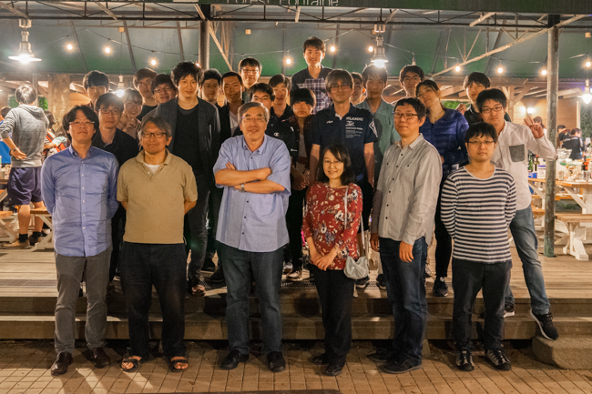

筑波大学HPCS研究室 卒研配属情報
=============

Welcome to HPCS ! [(2023年度のWORD原稿はこちら)](./word2023.pdf)
------------------
</img>

このサイトは[筑波大学 HPCS 研究室](https://www.hpcs.cs.tsukuba.ac.jp/)について，2024 年度配属の学生に向けた配属関連情報を提供します．
主に各教員と各教員が所属するチームの紹介，および現在行われている研究内容について紹介しています．

[</img>](requirements.md)
[</img>](schedule.md)
<a href="#チームについて">
	</img>
</a>

HPCS 研究室とは
--------------

筑波大学 High Performance Computing System (HPCS) 研究室では，超並列計算機システムからコモディティクラスタシステムまで，高性能計算 (High Performance Computing) に関連する様々な研究を行っています．

1. 各種並列処理システムにおける高性能計算と性能評価
1. プロセッサからネットワークまで計算機アーキテクチャに関する研究
1. GPUやメニーコア，FPGAなどの高性能計算向けアーキテクチャの研究
1. 高性能並列処理コンパイラの研究
1. 大規模データ処理 (ビッグデータ) 技術の研究
1. 大規模計算機を支えるストレージ技術やシステムソフトウェアに関する研究
1. 大規模計算機における高性能数値計算技術の研究

特に，[筑波大学計算科学研究センター](https://www.ccs.tsukuba.ac.jp/)で運用されている Cygnus, Pegasusでは，これらの大規模並列計算機を用いて各種計算科学応用分野と積極的な関係・共同研究を行っており，並列言語・ライブラリ・アルゴリズム等、様々な面で実世界に役立つ高性能計算の研究を進めています．
研究室にある大規模 PC クラスタの他，ABCI や TSUBAME など他機構のスパコンも利用しながら研究を行っています．

所属教員
--------

|教員名|職階|所属チーム|研究分野に関するキーワード|
|:-----|:---|:-------------------------|
|[朴 泰祐](http://www.hpcs.cs.tsukuba.ac.jp/~taisuke/)|教授|[アーキテクチャ](arcteam.md)|アクセラレータ, ネットワーク|
|[佐藤 三久](http://www.hpcs.cs.tsukuba.ac.jp/~msato/)|連携大学院教授|[PA](pateam.md)|並列プログラミング言語, メニーコア|
|[高橋 大介](http://www.hpcs.cs.tsukuba.ac.jp/~daisuke/)|教授|[アルゴリズム](ateam.md)|数値計算, メニーコア, アクセラレータ|
|[建部 修見](http://www.hpcs.cs.tsukuba.ac.jp/~tatebe/)|教授|[システムソフトウェア](ssteam.md)|分散ファイルシステム, 並列システムソフトウェア|
|[額田 彰](http://www.hpcs.cs.tsukuba.ac.jp/~nukada/)|教授|[パフォーマンス](perfteam.md)|性能最適化, GPUコンピューティング|
|[山口 佳樹](http://www.cs.tsukuba.ac.jp/~yoshiki/)|教授|[FPGA](fpgateam.md)|FPGA, リアルタイム処理|
|[多田野 寛人](http://www.hpcs.cs.tsukuba.ac.jp/~tadano/)|助教|[アルゴリズム](ateam.md)|線形方程式, 数値計算|
|[小林 諒平](https://sites.google.com/site/ryokbya/)|助教|[アーキテクチャ](arcteam.md)|FPGA, アクセラレータ|
|[藤田 典久]()|助教|[アーキテクチャ](arcteam.md)|FPGA, アクセラレータ|

チームについて
--------------

HPCS 研究室では，ハードウェアからソフトウェアまで HPC に関連する多様な研究分野を専門とする教員が集っています．
そのため，当研究室では研究分野ごとに細分化し，複数のチームを構成しています．

1. [アルゴリズムチーム](ateam.md)
    - 大規模数値計算，特に高性能数値計算ライブラリや大規模連立一次方程式の高速求解など科学技術計算に関する研究を行っています
1. [アーキテクチャチーム](arcteam.md)
    - ネットワークやアクセラレータ，特にFPGAやGPUなどの演算加速装置を用いた並列処理アーキテクチャとネットワークに関する研究を行っています
1. [FPGA チーム](fpgateam.md)
    - FPGA，特に FPGA を用いた大規模数値計算やリアルタイム処理などを行っています
1. [システムソフトウェアチーム](ssteam.md)
    - システムソフトウェア，特に並列ファイルシステムや DBMS など，並列分散システムに関わる基盤ソフトウェアの研究を行っています
1. [パフォーマンスチーム](perfteam.md)
    - 並列化や性能最適化など，高速に計算することを目的としたソフトウェア研究を行っています
1. [(PAチーム)](pateam.md) ※募集は大学院からとなります
    - プログラミング環境，特に大規模並列計算機に向けた並列プログラミング言語の開発を行っています

就職状況
--------
就職状況は極めて良好です．就職先は以下のような例があります．

| 卒業年度 | 組織名 |
|:-----|:-------|
| 2019 | LINE，Treasure Data，FreakOut，Cadence Design Systems, Inc.，エリクソン・ジャパン |
| 2018 | 筑波大学 計算科学研究センター，NTT 研究所，ヤフー，富士通，楽天，Fixstars|
| 2017 | 日立研究所，ヤフー，ドワンゴ，サイプレスセミコンダクタ |
| 2016 以前 | [筑波大学 計算科学研究センター](https://www.ccs.tsukuba.ac.jp/)，[理化学研究所 計算科学研究センター](https://www.r-ccs.riken.jp/jp/)，富士通研究所，NTT 研究所，[Google dublin](https://www.google.com/about/careers/locations/dublin/)，[ヤフー](https://about.yahoo.co.jp/)，CyberAgent，[Fixstars](https://www.fixstars.com/ja/)，リクルート，日立製作所，NTTデータ，パナソニック，株式会社ユーザーローカル，三菱スペース・ソフトウエア株式会社 |

インターンシップ先には以下のような例があります．

| 参加年度 | 組織名 |
|:-----|:-------|
| 2019 | 理化学研究所 |
| 2018 | 理化学研究所，NTT 研究所，[サイボウズラボ](http://labs.cybozu.co.jp/youth/requirements.html)，[Treasure Data](https://www.treasuredata.com/jp/)，PFN，メルカリ，LINE，Fixstars，ヤフー |
| 2017 | ヤフー，Fixstars |
| 2016 以前 | Argonne National Laboratory，日立製作所中央研究所，[ノーチラステクノロジーズ](http://www.nautilus-technologies.com/)，Fixstars |

募集要項
--------

本年度は，アルゴリズム，アーキテクチャ，FPGA，システムソフトウェア，パフォーマンスの 5 チームで卒研生を募集します．
詳細は[募集要項ページ](requirements.md)を参照してください．

問い合わせ先
--------
HPCS研究室について、疑問・質問などがあれば、お気軽にお問い合わせください。
宛先メールアドレス: openlab [at] hpcs.cs.tsukuba.ac.jp
