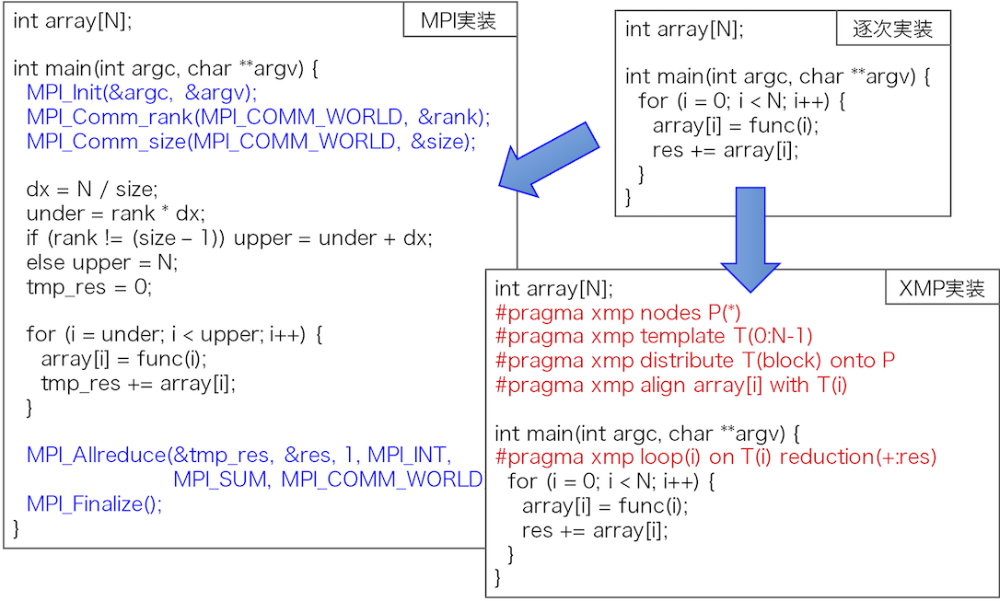

PAチーム
========

<!--
チーム概要
----------
-->

※PAチームは来年度の卒研生(学部生)の募集を行いません．院生のみとなります．

研究内容
--------

1. 大規模並列システム向け分散並列言語XcalableMP
1. アクセラレータ向け並列言語XcalableACC
1. アクセラレータ向けディレクティブベース言語OpenACCコンパイラの実装
1. メニーコアプロセッサ向けOpenMPランタイムの実装
1. FPGA向けOpenMP処理系の実装

</img>

他チームとの協力
----------------

並列プログラミング言語に関する研究は[アーキテクチャチーム](arcteam.md)とも共同研究を行い，アーキテクチャチームで開発および性能評価を行っているTCAシステムについて，我々が開発しているXcalableACCへTCA APIを組み込み，ディレクティブを用いて容易にTCAシステムを利用できるようにしました．

メンバー
--------

|教員名|職階|研究内容・メッセージ|
|:-----|---|:-------------------------|
|[佐藤 三久](http://www.hpcs.cs.tsukuba.ac.jp/~msato/)|連携大学院教授|並列プログラミング言語, メニーコア|
|[渡部　裕](https://ytn86.github.io)|M1|OpenMP, FPGA, SPGen 世界に挑戦していきましょう. 何をするにもあなた次第.  PAチームへの配属はM1からとなりますが,B4の間はArchitectureチームに所属しつつ指導を受けることができます.|

近年の研究成果について
----------------------

1. Tabuchi, Akihiro, Masahiro Nakao, Hitoshi Murai, Taisuke Boku, and Mitsuhisa Sato. "Implementation and Evaluation of One-sided PGAS Communication in XcalableACC for Accelerated Clusters." In Cluster, Cloud and Grid Computing (CCGRID), 2017 17th IEEE/ACM International Symposium on, pp. 625-634. IEEE, 2017.

1. Tsugane, Keisuke, Jinpil Lee, Hitoshi Murai, and Mitsuhisa Sato. "Multi-tasking Execution in PGAS Language XcalableMP and Communication Optimization on Many-core Clusters." In Proceedings of the International Conference on High Performance Computing in Asia-Pacific Region, pp. 75-85. ACM, 2018.

1. Tabuchi, Akihiro, Masahiro Nakao, Hitoshi Murai, Taisuke Boku, and Mitsuhisa Sato. "Performance evaluation for a hydrodynamics application in XcalableACC PGAS language for accelerated clusters." In Proceedings of Workshops of HPC Asia, pp. 1-10. ACM, 2018.

1. Watanabe, Yutaka, Jinpil Lee, Taisuke Boku, and Mitsuhisa Sato. "Trade-Off of Offloading to FPGA in OpenMP Task-Based Programming." In International Workshop on OpenMP, pp. 96-110. Springer, Cham, 2018.
