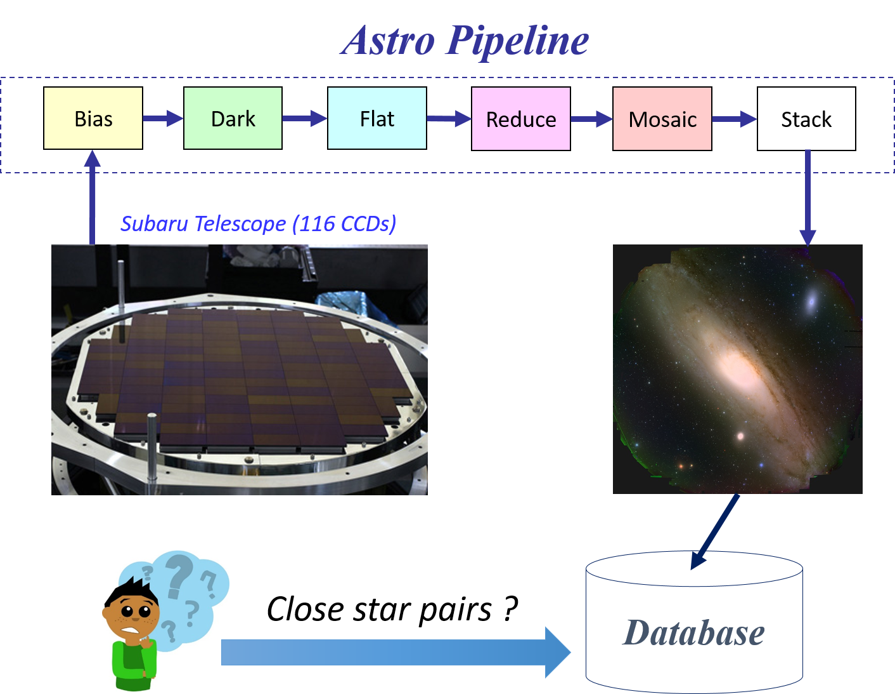
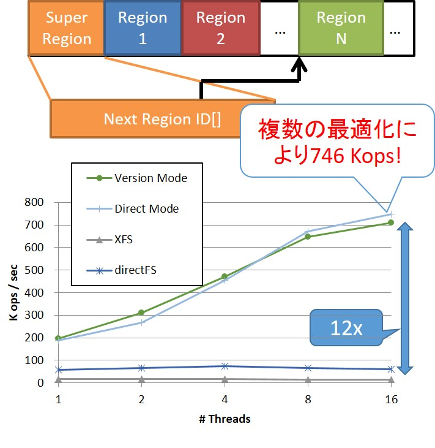

システムソフトウェアチーム
==================
<!-- this is a comment. -->

------------

2017年9月伊香保温泉における実装合宿

<!--
/img>-->

研究トピック
------------

#### [HPC, ビッグデータ, AI](http://www.extreme-bigdata.jp/?page_id=79)の基盤技術
<iframe width="560" height="315" src="https://www.youtube.com/embed/XvcKs-c9nA8" frameborder="0" allow="autoplay; encrypted-media" allowfullscreen></iframe>
[HPC, ビッグデータ, AI](http://www.extreme-bigdata.jp/?page_id=79)とは, 現状の数千〜数百万倍ともいわれる大規模ビッグデータであり, 様々な分野で今後その大きさのビッグデータ解析が必要といわれています. その大きさのデータを処理するためには, HPC, クラウド, グリッド技術をベースに基盤技術の研究開発が必要となります. そこで, 分散ストレージシステム, 並列分散実行時システムなどの研究開発を行っています. 

#### 分散ファイルシステム

ビッグデータ処理を行うためのソフトウェア基盤として<a href=http://oss-tsukuba.org/software/gfarm>Gfarmファイルシステム</a>の開発を行っています. 本ソフトウェアは研究開発基盤としてだけではなく, <a href=http://www.hpci-office.jp/pages/hpci_2016_st-1>HPCI共用ストレージ</a>や[Active! world](https://active-world.jp/)など大規模な実運用もされています. Gfarmファイルシステムをベースに新しい機能の拡張や性能評価など研究も進められますし, 新しいファイルシステムの研究開発もできます. 

#### [天文ビッグデータ](https://www.jst.go.jp/kisoken/crest/project/44/14532369.html)

[Kavli IPMU](http://www.ipmu.jp/ja), [国立天文台](http://www.nao.ac.jp/)との共同研究により, 宇宙の詳細な仕組みについて解明する研究を行っています.  右の図では, すばる望遠鏡から得られたデータが天文パイプラインにより処理され, その結果として美しい画像が得られる様子が示されています. 毎晩の撮像データサイズは数百GBです.   
世界的な競争に勝つために, この天文パイプラインを高速化する必要があります. そのためには, ログ先行書込み, 分散トランザクション, そして並行実行制御などの技術を深化させる必要があり, それらに取り組んでいます.  さらに, 画像から得られる銀河の数は100億以上です. これらのデータはいわゆるDBMSにおいて管理されるため, その高速処理が必要になります. そこでMapReduce処理系, 空間索引, 分散合意技術などのデータシステム技術を深化させています. 
</img>

#### OpenNVMを用いたオブジェクトストレージシステム
分散ファイルシステムを高性能化するには, メタデータ操作を高性能化する必要があります. このために我々はオブジェクトストレージシステムを新たに研究開発しました. このシステムはOpenNVMと呼ばれる不揮発メモリ向けの新しいAPIを駆使することで, 従来のシステムであるXFSやdirectFSに比べて10倍以上の高性能化を達成しています. 具体的には48bitの仮想アドレス空間, 書込み単位でのアトミックな更新を利用しています. [[詳細はこちら]](https://www.jstage.jst.go.jp/article/ipsjjip/24/5/24_824/_pdf)
</img>

<!--ここに研究トピックについて記述します．-->

<!-- 所属教員・研究員 -->

研究室説明会日程
--------
##全体説明会
10 / 3 (水), 16:45 - 18:00
(注意) 全体説明会において，SS チームの紹介は行われません．
##研究室公開
10 / 3 (水), 18:15 - 19:00
10 / 12 (金), 18:15 - 19:00
10 / 22 (月), 18:15 - 19:00
メンバー
--------

<!-- |教員名|職階|研究分野に関するキーワード| -->

|名前|職階|研究内容・メッセージ| 
|:-----|:---|:-------------------------|
|[建部 修見](http://www.hpcs.cs.tsukuba.ac.jp/~tatebe/)|教授|分散ファイルシステム, 並列システムソフトウェア システムソフトウェアに興味がある人, 大きいことをやってみたい人は是非どうぞ. 好きなことをやってください. |
|川島 英之|慶應義塾大学 准教授|データベースシステム 私は3月までHPCSシステムソフトウェアチームに所属していました．4月から慶應義塾大学に移動しましたが，現在でも共同研究をしています．このチームには，世界と戦える実力があります．私の専門分野であるデータカーネル技術においても，日本でこのチームにしかない先端的技術が多数あります．研究費は潤沢であり，設備は万全であり，建部先生は立派な方です．研究内容は，やって面白く，現実に役立ち，しかも良い就職に直結，と三拍子揃っています．興味を持ったら，ぜひ話を聞きにきてください．|
|田中 昌宏|研究員|並列分散ワークフローシステムPwrake Rakeをベースにして設計され, 分散ファイルシステムGfarmと高い親和性をもつワークフローシステムPwrakeを研究開発しています. [RubyKaigiでの講演はこちら](http://rubykaigi.org/2016/presentations/masa16tanaka.html)|
|平賀 弘平|D3|-|
|岩井 厚樹|M2|サイエンスアプリケーションを用いたIO性能測定 SystemSoftwareチームは100台を超える計算機を所有しています. それらを使ってプログラムを実行することはもちろん, 計算機の保守・管理も経験することができます. 私たちと一緒にこの恵まれた環境で研究してみませんか？|
|小林 淳司|M2|分散ファイルシステム HPCS研究室には研究を行うための環境がそろっていて, 新しい技術に触れられる機会も多いです. ビッグデータやその基盤となる技術を研究してみたいという方にはとてもいい研究室だと思います. |
|中村 泰大|M2|並行実行制御手法<a href="http://people.csail.mit.edu/sanchez/papers/2016.tictoc.sigmod.pdf">TicToc</a>の改善 先生・先輩からのサポートも手厚く, 個々人の興味に合わせて研究内容を, 一緒になって真剣に考えていけます. いわゆるビッグデータの花形となる分野ではなく, その基盤となる分野を取り扱っています. エンジニアやビッグデータを支えるものづくり/研究に興味がある方にぴったりかと思います. |
|渡辺 敬之|M2|並行実行索引木<a href="https://pdos.csail.mit.edu/papers/masstree:eurosys12.pdf">MassTree</a>の改善 たくさんの計算機を所有しており, それらを使って個人ではできないレベルの高い研究をすることができます. わからないことを先輩や先生に尋ねると, とても親切に教えてもらえ最新の技術を学ぶことができます. また, 頻繁に先生と打ち合わせをする機会があるので, どう進めればよいかわからなくなることもありません. |
|梶原 顕伍|M2|分散合意手法<a href="https://www.usenix.org/system/files/conference/atc14/atc14-paper-ongaro.pdf">RAFT</a>の改善 この研究室では優秀な先生方, 先輩方にサポートしてもらいながらビッグデータの基盤技術を学べます. この分野を学ぶにあたって, コンピュータ・アーキテクチャとプログラミングの両方の理解が不可欠なので両方とも学びたいというよくばりな人に向いていると思います. 個人的にテニスをやっているのでテニスに興味のある人もぜひ. |
|河合 祐輔|M1|極端気象現象に関するアプリケーションの並列化と評価補助 多くの計算機があり, 非常に恵まれた環境で好きなことを研究することができます. ビッグデータ処理などに興味がある方は是非.|
|北澤 昂大|M1|分散ファイルシステムGfarmとクラウドストレージの統合システムソフトウェア 最新の技術を学ぶ機会を与えてくれる良い研究室だと思います. 最近流行りのビッグデータ処理(機械学習, AI,クラウド)などの基盤となるシステムを身近に感じながら学ぶことが出来ます. また先生が優しそうだったのが入った動機の1つでしたが本当に良い先生だった研究室です. ただ先生はご多忙な方なので、研究を進めるにあたって多少の主体性(受け身だけでなくて自分で聞いたり調べるなど)は必要だと感じていますが毎週進捗報告があるので相談する機会は用意されていると思います. |
|町田 健太|M1|Pwrake/Gfarmによる並列分散相同性検索システムの提案 この研究室は、広々としたスペース・4Kディスプレイ・高級椅子/ソファを備え、かつ飲食物もたくさん蓄えておりもはや住めるんじゃないかって思います。先生は人当たりがよい方で研究室はいつも穏やかな空気が流れてるので、伸び伸びと研究に励むことができます。コアタイムは特に無いですが、毎週進捗報告会があるので適度に厳しさがあります。全然ブラック研究室じゃないです！|
|芹沢 和洋|M1|深層学習の高速化手法の研究 私は学部卒業後に9年間の社会人経験を経てCSを勉強し直すために入学したおっさんですが, 先生方や周りの学生の皆さんには分け隔てなく接していただき何不自由なく研究に没頭できています.  メニーコアマシンだけでなくV100/P100といったGPUを使った実験ができます. GPGPU/深層学習に興味がある人にもおすすめの研究室です.|
|佐藤 拓人|M1|気象学大規模データの解析 気象分野とのデュアルディグリープログラムです。気象学LESモデルの高性能化や, 気象学で作られる大規模データの解析に取り組んでいます。他分野とのコラボレーションもあり非常に活き活きとした環境です。|
|澤田 一樹|M1|分散ファイルシステムにおけるノードローカルバーストバッファの活用 NVMeが大好きです。広い研究室と充実した備品で快適に研究ができます。MTがこまめにあるので意思疎通もしやすいです。|
|田辺 敬之|M1|高性能トランザクション処理, 並行性制御，ログ永続化 とても充実した環境で自己研鑽に励むことができる研究室だと思います．B4 で Hello World から始めても，一年後には世界が視界に入ってくる，そういう環境です．共に世界に挑みましょう．|
|田村 駿弥|M1|並行木構造 木構造の専門家です。好きな木構造は MassTree です．並列プログラミングに自信があります．並列プログラミング・並行木構造・C言語等に関心がある，自信がある人は熱く議論しましょう！！|
|堀江 悠樹|M1|ブロックチェーンに新たな旋風を巻き起こします。|
|杉原 航平|B4|ノードローカルストレージを活用したアプリケーションレベルバーストバッファの検討 SS チームでは高速インターコネクトである InfiniBand や高速ストレージの NVMe SSD を搭載したノードを含む，合計 100 台規模の計算機を独自に所有していて，個人で構築するには難しいような高性能でかつ大規模な計算環境のもと実験を行うことができます．研究室の環境も良く，潤沢な計算資源と素晴らしい環境が揃った居心地の良い研究室です．|
|[高橋 宗史](https://hpcs.cs.tsukuba.ac.jp/~shuuji3)|B4|分散オブジェクトストレージ Ceph の性能改善 この研究室では、充実した環境で研究に取り組むことができます。実験では、研究室所有の高性能なコンピュータクラスタ(SSチームだけで約100ノード！)が自由に利用できます。|
|横田 健太|B4|TOEIC900点超えは当たり前|
|畑中 智之|B3|充実した環境で研究に取り組むことができます．潤沢な計算機資源を使って研究をしてみたい方はぜひ．|

研究論文
----------------------

### 論文誌 ###
### 国際発表 ###

1. Integration of Parallel Write Ahead Logging and Cicada Concurrency Control Method
    - Takayuki Tanabe, Hideyuki Kawashima, Osamu Tatebe
    - 2nd IEEE International Workshop on Big Data and IoT Security in Smart Computing (BITS2018)

1. Applying Pwrake Workflow System and Gfarm File System to Telescope Data Processing
    - Masahiro Tanaka, Osamu Tatebe, Hideyuki Kawashima
    - 2018 IEEE International Conference on Cluster Computing (CLUSTER), pp. 113-122, Sep. 2018.

1. PPMDS: A Distributed Metadata Server based on Nonblocking Transactions
    - Kohei Hiraga, Osamu Tatebe, Hideyuki Kawashima
    - Proceedings of the Second International Workshop on Data Science Engineering and its Applications, 2018

1. Integrating TicToc with Parallel Logging
    - Yasuhiro Nakamura, Hideyuki Kawashima, Osamu Tatebe
    - The Sixth International Symposium on Computing and Networking (CANDAR 2018)

### 国内発表 ###

情報処理学会HPC研究会とOS研究会に投稿した研究会原稿に関して，筑波大学は情報処理学会と機関契約をしていますので，これらの原稿は筑波大学構内のネットワークからは自由にダウンロード可能です．

1. 並行性制御法 Cicada の評価
    - 田辺敬之, 川島英之, 建部修見
    - 第10回データ工学と情報マネジメントに関するフォーラム, 第16回日本データベース学年次大会 (DEIM2018)

1. 並行性制御法 Cicada と並列ログ先行書き込み法 P-WAL の結合
    - 田辺敬之, 川島英之, 建部修見
    - xSIG2018, cross-disciplinary workshop on computing Systems, Infrastructures, and programming

1. サイエンティフィックビッグデータアプリケーションのためのベンチマークセットの提案
    - 岩井厚樹, 建部修見
    - SWoPP2018

2017年以前は<a href="https://www.hpcs.cs.tsukuba.ac.jp/publications/">こちら</a>より参照できます. 

日常生活
----------------------
1. 週に一回，2-3時間のチームミーティングをします. ここでは簡単に進捗報告をします. また，週に一回全体ミーティングも行います．これはHPCS研究室の全チームが集まって行うミーティングです．
1. 上記以外に個別ミーティングを週に1回程度やります. ここでは一緒に論文を読んだり, 研究の方向性を考えたりします. 
1. コアタイムはありませんが, 午前中にきて夕方に帰る人が多いようです. ラボくるとなんか楽しくていいですね. 
1. 研究室内には, 電子レンジ, 冷蔵庫, 電気ポット, コーヒーメーカー, ソファ等の備品もあり, 所属している学生は自由に使用することができます. また，物販もあり，軽食・飲み物等が購入可能です．
1. 楽しいイベントが多数あります. 
1. 開発合宿を毎年やります. 
