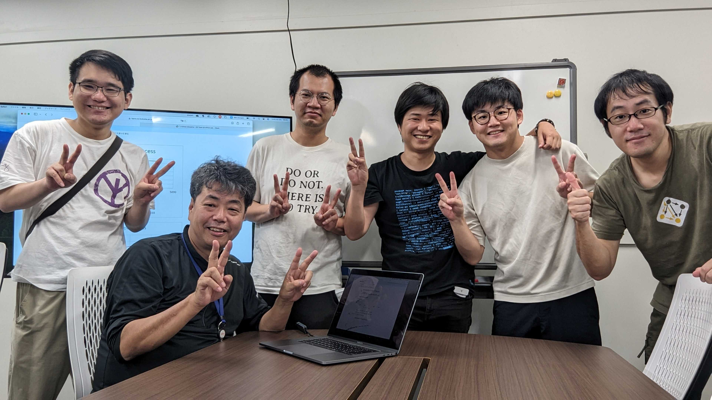

# システムソフトウェアチーム

</img>

## 研究トピック

### 建部 修見 教授

#### HPC・ビッグデータ・AIのための並列分散システムソフトウェア

HPC, ビッグデータ, AIのための並列分散システムソフトウェアの研究を行います．演算性能はGPU等の演算加速器により高速化が図られますが, ストレージ性能とのギャップが問題となっています．HPC, ビッグデータ, AIではこのギャップの解消が急務となっており、アーキテクチャ, ソフトウェアの両面から問題に取り組みます．HPC用大規模PCクラスタ, <a href="https://www.ccs.tsukuba.ac.jp/supercomputer/#Cygnus">Cygnus</a>等のスパコンを利用して研究を進めていきます．以下のビデオは以前の研究プロジェクトのハイライトです．

<iframe width="560" height="315" src="https://www.youtube.com/embed/XvcKs-c9nA8" frameborder="0" allow="autoplay; encrypted-media" allowfullscreen style="max-width: 100%"></iframe>

2022年から筑波大には不揮発性メモリを大規模に導入したビッグメモリスーパコンピュータPegasus が導入されました。Pegasus の大容量メモリ、また大容量不揮発性メモリを用いて研究を進めていきます。テーマの例としては以下のようなものがありますが、相談して決めていきます

#### テーマの例

1. 並列分散ストレージシステム，キャッシングファイルシステム

1. 並列I/O, Python などのクライアントライブラリ

1. 深層学習システム、並列アプリケーションの性能評価、高性能化

## 研究室説明会日程
最終更新日: 2023-09-16

### 研究室公開
|日付|時間|場所|
|:---|:---|:---|
|2023/10/4  (水)|15:15 ~ 17:00|総合研究棟B 1222|
|2023/10/9 (月)|13:45 ~ 15:00|3A405（分散システム後）|
|2023/10/20 (金)|18:15 ~ 19:30|総合研究棟B 1222|
<!--
 今年は物理開催とオンラインの両方で研究室説明会を行います.   
オンライン開催のリンクについては[説明会スケジュール](https://www.hpcs.cs.tsukuba.ac.jp/bachelor/#!schedule.md)ページのリンク先のGoogle Formからリモート参加の受付を行ってください.
-->

## メンバー

<!-- |教員名|職階|研究分野に関するキーワード| -->

| 名前 | 職階 | 研究内容・メッセージ |
|:-----|:---|:-------------------------|
|[建部 修見](http://www.hpcs.cs.tsukuba.ac.jp/~tatebe/index-j.html)|教授|分散ファイルシステム, 並列システムソフトウェア システムソフトウェアに興味がある人, 大きいことをやってみたい人は是非どうぞ. 好きなことをやってください. |
| 平賀 弘平 | 研究員 | 分散メタデータサーバ、MPI-IO分散システムやシステムソフトウェアに興味のある方はぜひ一緒に研究しましょう。不揮発性メモリを使ってみたい方もどうぞ！ |
| 前田 宗則 | 主任研究員 | 産学連携プロジェクトで富士通株式会社から来ました研究員です. 高速な分散データストアの重要性は増しています. この研究室で一緒にやりましょう.|
| 中谷 裕一 | D2 |負荷が均等となるコンシステントハッシングの研究をしています|
| 杉原 航平 | D1 |ノードローカルバーストバッファの検討 研究室の人数よりも計算機の方が多い研究室です。クラスタやスーパーコンピューターを使って研究してみたい人はぜひ！ |
| 兪明哲 | D1 | 分散学習の耐障害性についての研究を考えています |
| 木下 嵩裕 | M2 |  ハードウェアの特性を汲んだ不揮発メモリの効率的な使い方  潤沢な計算資源，環境があります．ぜひ一緒に研究しましょう．  |
| 小山 創平 | M2 | アドホックファイルシステムを開発しています。一緒にIO500上位を目指しましょう |
| 丸山 泰史 | M1 | 研究テーマを選ぶ自由を与えてくれる研究室です。やりたいことをやりましょう。|
| 中野 将生 | B4 | Rustの非同期機構のHPC上での評価と応用  HPCに限らず色々な分散システムの話をしましょう |

## 研究論文

最新の論文は[建部先生の個人ページ](http://www.hpcs.cs.tsukuba.ac.jp/~tatebe/research/publication-j.html)をご参照ください。

### 国際発表

1. Fast checkpointing of Large Language Models with TensorStore CHFS
    - Sohei Koyama, Kohei Hiraga, Osamu Tatebe, 
    -  SC23 Graduate Posters ACM Student Research Competition, 2023 (to appear)

1. I/O-Aware Flushing for HPC Caching Filesystem
    - Osamu Tatebe, Kohei Hiraga, Hiroki Ohtsuji,
    -  Proceedings of 3rd Workshop on Re-envisioning Extreme-Scale I/O for Emerging Hybrid HPC Workloads (REX-IO), 2023 (to appear)

1. Accelerating I/O in Distributed Data Processing Systems with Apache Arrow CHFS
    - Sohei Koyama, Kohei Hiraga, Osamu Tatebe,
    -  Proceedings of 3rd Workshop on Re-envisioning Extreme-Scale I/O for Emerging Hybrid HPC Workloads (REX-IO), short paper, 2023 (to appear)

1. [Cygnus - World First Multihybrid Accelerated Cluster with GPU and FPGA Coupling](https://dl.acm.org/doi/10.1145/3547276.3548629)
    - Taisuke Boku, Norihisa Fujita, Ryohei Kobayashi, Osamu Tatebe,
    - Proceedings of 2nd International Workshop on Deployment and Use of Accelerators (DUAC), Article No.8, pp.1-8, 10.1145/3547276.3548629, 2022

1. [Scalable Data Parallel Distributed Training for Graph Neural Networks](https://ieeexplore.ieee.org/document/9835176)
    - Sohei Koyama, Osamu Tatebe,
    - Proceedings of Workshop on AI for Datacenter Optimization (ADOPT'22), pp.699-707, 10.1109/IPDPSW55747.2022.00121, 2022

1. [Caching Support for CHFS Node-local Persistent Memory File System](https://ieeexplore.ieee.org/document/9835238)
    - Osamu Tatebe, Hiroki Ohtsuji,
    - Proceedings of 3rd Workshop on Extreme-Scale Storage and Analysis (ESSA 2022), pp.1103-1110, 10.1109/IPDPSW55747.2022.00182, 2022

1. [CHFS: Parallel Consistent Hashing File System for Node-local Persistent Memory](https://dl.acm.org/doi/10.1145/3492805.3492807)
    - Osamu Tatebe, Kazuki Obata, Kohei Hiraga, Hiroki Ohtsuji,
    - Proceedings of the ACM International Conference on High Performance Computing in Asia-Pacific Region (HPC Asia 2022), pp.115-124, 10.1145/3492805.3492807, 2022

### 国内発表
情報処理学会HPC研究会とOS研究会に投稿した研究会原稿に関して，筑波大学は情報処理学会と機関契約をしていますので，これらの原稿は筑波大学構内のネットワークからは自由にダウンロード可能です．

1. [Pegasusビッグメモリスーパコンピュータの性能評価](https://ipsj.ixsq.nii.ac.jp/ej/?action=pages_view_main&active_action=repository_view_main_item_detail&item_id=227118&item_no=1&page_id=13&block_id=8)
    - 建部 修見 , 平賀 弘平 , 前田 宗則 , 藤田 典久 , 小林 諒平 , 額田 彰
    - 情報処理学会 第190回 HPC 研究会報告

1. [Apache Arrow CHFSによるビッグデータ処理のI/O高速化](https://ipsj.ixsq.nii.ac.jp/ej/?action=pages_view_main&active_action=repository_view_main_item_detail&item_id=227116&item_no=1&page_id=13&block_id=8)
    - 小山 創平 , 平賀 弘平 , 建部 修見
    - 情報処理学会 第190回 HPC 研究会報告

1. [分散キャッシュファイルシステムの設計と実装](https://ipsj.ixsq.nii.ac.jp/ej/?action=pages_view_main&active_action=repository_view_main_item_detail&item_id=220228&item_no=1&page_id=13&block_id=8)
    - 笠井 大暉 , 建部 修見
    - 情報処理学会 第186回 HPC 研究会報告

1. [MPI-IO/CHFS:ノードローカル不揮発性メモリを活用するアドホック分散ファイルシステムのためのMPI-IOの設計](https://ipsj.ixsq.nii.ac.jp/ej/?action=pages_view_main&active_action=repository_view_main_item_detail&item_id=218971&item_no=1&page_id=13&block_id=8)
    - 平賀 弘平 , 建部 修見
    - 情報処理学会 第185回 HPC 研究会報告

1. [CHFSアドホック並列分散ファイルシステムのアクセス性能の評価](https://ipsj.ixsq.nii.ac.jp/ej/?action=pages_view_main&active_action=repository_view_main_item_detail&item_id=218969&item_no=1&page_id=13&block_id=8)
    - 建部 修見
    - 情報処理学会 第185回 HPC 研究会報告

1. [HPC環境を想定した探索的データ解析におけるノードローカルストレージの利用の検討](https://ipsj.ixsq.nii.ac.jp/ej/?action=pages_view_main&active_action=repository_view_main_item_detail&item_id=218957&item_no=1&page_id=13&block_id=8)
    - 巨畠 和樹 , 小山 創平 , 平賀 弘平 , 建部 修見
    - 情報処理学会 第185回 HPC 研究会報告

1. [不揮発性メモリを用いた分散オブジェクトストレージの設計](https://ipsj.ixsq.nii.ac.jp/ej/?action=pages_view_main&active_action=repository_view_main_item_detail&item_id=217758&item_no=1&page_id=13&block_id=8)
    - 巨畠 和樹 , 建部 修見
    - 情報処理学会 第184回 HPC 研究会報告

1. [計算ノード上の不揮発性メモリを用いたMPI-IOバーストバッファの設計](https://ipsj.ixsq.nii.ac.jp/ej/?action=pages_view_main&active_action=repository_view_main_item_detail&item_id=217502&item_no=1&page_id=13&block_id=8)
    - 平賀 弘平 , 建部 修見
    - 情報処理学会 第183回 HPC 研究会報告

1. [計算ノードの不揮発性メモリを用いたキャッシュファイルシステムの設計](https://ipsj.ixsq.nii.ac.jp/ej/?action=pages_view_main&active_action=repository_view_main_item_detail&item_id=217486&item_no=1&page_id=13&block_id=8)
    - 建部 修見
    - 情報処理学会 第183回 HPC 研究会報告

2022年以前は[こちら](https://www.hpcs.cs.tsukuba.ac.jp/publications/)より参照できます. 

## 日常生活

1. コロナウイルスが収束しつつあるため、ミーティングが対面になりました. チームミーティングは週に一回, 全体ミーティングは月に一回程です. 
1. コアタイムはありません 
1. 研究室内には, 電子レンジ, 冷蔵庫, 電気ポット, コーヒーメーカー, ソファ等の備品もあり, 所属している学生は自由に使用することができます. また，物販もあり，軽食・飲み物等が購入可能です．
1. 楽しいイベントがいくつかあります
